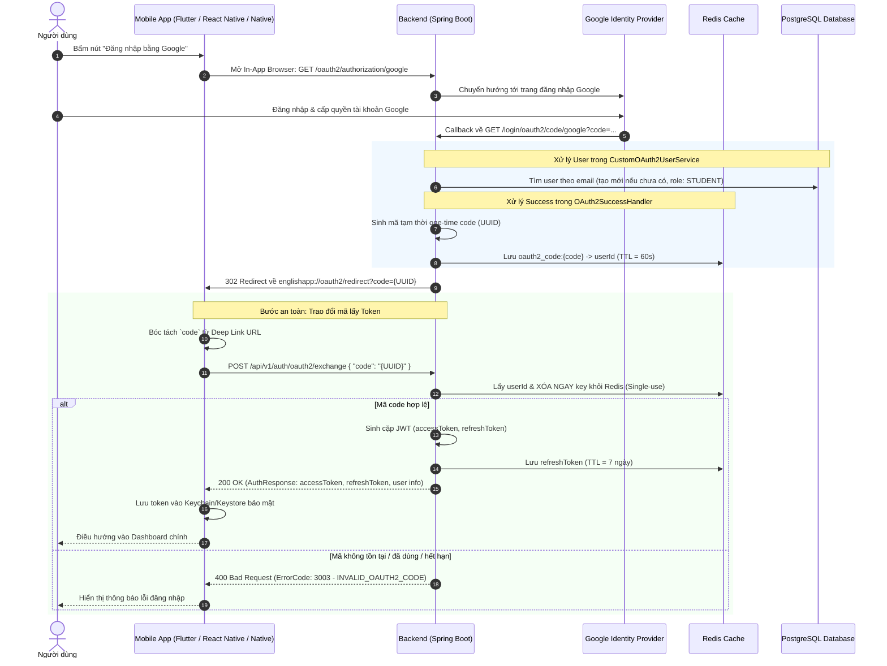

# Hướng Dẫn Tích Hợp Đăng Nhập Google (Google OAuth2 Integration Guide)

Tài liệu hướng dẫn chi tiết quy trình tích hợp chức năng **Đăng nhập bằng Google** giữa Frontend (React/TypeScript, Mobile) và Backend (Spring Boot 3, Spring Security OAuth2, Redis) theo chuẩn bảo mật **One-Time Code Exchange**.

---

## 1. Kiến Trúc & Luồng Hoạt Động (Flow Architecture)

Hệ thống áp dụng mô hình **Authorization Code Exchange** qua mã dùng một lần (One-Time Temporary Code).
- **Mục tiêu bảo mật:** Không truyền `accessToken` và `refreshToken` trực tiếp trên URL Query Parameter nhằm tránh rò rỉ token qua Browser History, Server Access Logs và Header `Referer`.

### Sơ đồ tuần tự (Sequence Diagram)



---

## 2. Đặc Tả API (API Specification)

### 2.1. Bước 1: Kích hoạt đăng nhập Google (FE $\rightarrow$ BE)

* **Endpoint:** `GET /oauth2/authorization/google`
* **URL Backend Local:** `http://localhost:8080/oauth2/authorization/google`
* **Mô tả:** Frontend không gọi API bằng `fetch` hay `axios` mà **chuyển hướng trực tiếp toàn bộ trang web** (hoặc mở popup webview trên Mobile).
* **Ví dụ gọi từ Frontend:**
  ```typescript
  const handleGoogleLogin = () => {
    window.location.href = `${import.meta.env.VITE_API_BASE_URL || 'http://localhost:8080'}/oauth2/authorization/google`;
  };
  ```

---

### 2.2. Bước 2: Trang hứng chuyển hướng (Redirect Callback Page trên FE)

Sau khi hoàn tất đăng nhập tại Google, Backend sẽ chuyển hướng người dùng về:
```
{FRONTEND_URL}/oauth2/redirect?code=550e8400-e29b-41d4-a716-446655440000
```
*(Cấu hình trong `application.yaml`: `spring.security.oauth2.redirect-uri`)*

* **Trường hợp thành công:** URL chứa tham số `code` (mã ngẫu nhiên UUID, hết hạn sau **60 giây**).
* **Trường hợp tài khoản bị khóa:** URL chứa tham số `?error=account_locked`.

---

### 2.3. Bước 3: Đổi mã xác thực lấy Token (FE $\rightarrow$ BE)

Endpoint này cho phép người dùng đổi mã `code` lấy token JWT đầy đủ mà không cần xác thực trước (Public API).

* **Endpoint:** `POST /api/v1/auth/oauth2/exchange`
* **Content-Type:** `application/json`

#### Request Body:
```json
{
  "code": "550e8400-e29b-41d4-a716-446655440000"
}
```

#### Response Thành công (`200 OK`):
```json
{
  "code": 1000,
  "message": "Thành công",
  "data": {
    "accessToken": "eyJhbGciOiJSUzI1NiIsInR5cCI6IkpXVCJ9...",
    "refreshToken": "d8e35cf8-5182-4f11-9e8c-8f96b27e69c0",
    "tokenType": "Bearer",
    "expiresIn": 3600,
    "userId": 15,
    "email": "student@example.com",
    "fullName": "Nguyen Van A",
    "avatarUrl": "https://lh3.googleusercontent.com/a/...",
    "role": "STUDENT",
    "provider": "GOOGLE"
  }
}
```

#### Bảng mã lỗi có thể trả về:

| HTTP Status | Error Code | Ý nghĩa | Cách xử lý ở Frontend |
| :--- | :--- | :--- | :--- |
| **400 Bad Request** | `3003` | Mã xác thực không hợp lệ hoặc đã hết hạn (`INVALID_OAUTH2_CODE`) | Báo lỗi đăng nhập thất bại và yêu cầu thử lại |
| **400 Bad Request** | `1002` | Tài khoản đã bị vô hiệu hóa (`ACCOUNT_LOCKED`) | Thông báo tài khoản bị khóa, liên hệ admin |
| **400 Bad Request** | `4001` | Payload thiếu field `code` | Kiểm tra request gửi từ Frontend |
| **404 Not Found** | `2001` | Người dùng không tồn tại (`USER_NOT_FOUND`) | Báo lỗi hệ thống |

---

## 3. Hướng Dẫn Tích Hợp Dành Cho Ứng Dụng Mobile

Phần này mô tả chi tiết quy trình tích hợp phía Mobile App (Flutter, React Native, iOS/Android Native) theo chuẩn OAuth 2.0 hiện đại, tập trung vào kiến trúc luồng, Deep Linking và các bước xử lý logic (không phụ thuộc vào framework cụ thể).

---

### 3.1. Nguyên Tắc & Yêu Cầu Nền Tảng

1. **Không sử dụng WebView nhúng nội bộ:**
   * Google cấm hoàn toàn việc đăng nhập OAuth thông qua WebView thông thường (lỗi `disallowed_useragent`) vì lý do bảo mật (chống đánh cắp thông tin đăng nhập và tấn công Man-in-the-middle).
   * **Bắt buộc dùng trình duyệt an toàn của hệ điều hành (In-App Browser System):**
     * **iOS:** `ASWebAuthenticationSession` hoặc `SFAuthenticationSession`.
     * **Android:** `Chrome Custom Tabs`.
     * *Thư viện tham khảo theo framework:*
       * Flutter: `flutter_custom_tabs`, `url_launcher`.
       * React Native: `react-native-inappbrowser-reborn`, `expo-auth-session` / `expo-web-browser`.
       * Native Android: `androidx.browser.customtabs.CustomTabsIntent`.
       * Native iOS: `AuthenticationServices (ASWebAuthenticationSession)`.

2. **Cơ chế chuyển hướng về App qua Deep Link / Custom Scheme:**
   * Backend sẽ điều hướng về URI định danh của ứng dụng di động (ví dụ: `englishapp://oauth2/redirect?code=...`) thay vì đường dẫn web HTTP thông thường.

---

### 3.2. Quy Trình Tích Hợp 5 Bước Trên Mobile

#### Bước 1: Khai báo Deep Link (Custom URL Scheme)
* Đăng ký một Custom Scheme định danh riêng cho app trong cấu hình ứng dụng:
  * **Android:** Đăng ký `intent-filter` trong `AndroidManifest.xml` bắt scheme `englishapp` và host `oauth2`.
  * **iOS:** Khai báo `CFBundleURLSchemes` trong `Info.plist` với scheme `englishapp`.
* Định dạng URI nhận diện sau khi đăng nhập:
  `englishapp://oauth2/redirect`
* Đảm bảo cấu hình biến môi trường `SPRING_SECURITY_OAUTH2_REDIRECT_URI` ở Backend khớp với URI này (hoặc cấu hình Universal Link/App Link tương ứng).

#### Bước 2: Kích hoạt phiên đăng nhập từ Mobile App
* Khi người dùng nhấn nút **"Đăng nhập bằng Google"**:
  * Ứng dụng khởi chạy phiên In-App Browser với URL khởi tạo:
    `{BACKEND_URL}/oauth2/authorization/google`
  * Đồng thời cấu hình cho trình duyệt biết callback scheme cần bắt là `englishapp`.
* Trình duyệt hệ thống mở ra, tự động chuyển người dùng đến màn hình đăng nhập tài khoản Google.

#### Bước 3: Đón nhận Callback và đóng trình duyệt In-App
* Sau khi người dùng đăng nhập và ủy quyền thành công:
  * Google chuyển về Backend.
  * Backend hoàn tất tạo User và thực hiện lệnh chuyển hướng (302 Redirect) về:
    `englishapp://oauth2/redirect?code={UUID}`
* Hệ điều hành tự động nhận diện Custom Scheme:
  * Trình duyệt In-App tự động đóng lại (dismiss) một cách mượt mà.
  * Quyền điều khiển được trao lại cho Mobile App kèm theo toàn bộ URL chuyển hướng.
* **Xử lý các tình huống tại Mobile:**
  * **Thành công:** Bóc tách giá trị của tham số `code` từ URL query.
  * **Người dùng hủy:** Nếu người dùng chủ động bấm nút "Cancel" hoặc vuốt tắt trình duyệt trước khi hoàn tất -> Mobile dừng quá trình tải và không báo lỗi.
  * **Tài khoản bị khóa:** URL trả về `?error=account_locked` -> Hiển thị popup thông báo tài khoản bị khóa.

#### Bước 4: Gọi API Backend đổi mã lấy Token (Code Exchange)
* Ứng dụng bật trạng thái tải dữ liệu (Loading / Spinner).
* Gửi một HTTP request dạng POST tới endpoint Backend:
  * **URL:** `POST {BACKEND_URL}/api/v1/auth/oauth2/exchange`
  * **Headers:** `Content-Type: application/json`
  * **Body:** Đối tượng JSON chứa mã `code` vừa nhận được.
* **Xử lý kết quả trả về từ Backend:**
  * **Thành công (HTTP 200):** Nhận về `AuthResponse` gồm `accessToken`, `refreshToken`, thời hạn `expiresIn`, thông tin cá nhân (`userId`, `email`, `fullName`, `avatarUrl`, `role`).
  * **Thất bại (HTTP 400 - mã lỗi 3003 / 1002):** Hiển thị thông báo mã xác thực hết hạn hoặc không hợp lệ, yêu cầu người dùng thao tác lại.

#### Bước 5: Lưu trữ phiên đăng nhập an toàn & Điều hướng
* **Lưu trữ bảo mật:**
  * Tuyệt đối không lưu token vào bộ nhớ thông thường (như `SharedPreferences` dạng plain text hoặc `AsyncStorage` không mã hóa).
  * Lưu `accessToken` và `refreshToken` vào vùng nhớ mã hóa phần cứng của thiết bị:
    * **Android:** `EncryptedSharedPreferences` / `Android Keystore`.
    * **iOS:** `iOS Keychain Services`.
* **Khởi tạo trạng thái phiên:**
  * Đặt token vào bộ quản lý trạng thái xác thực toàn cục (State Management: Redux / Bloc / Zustand / Provider).
  * Cập nhật `Authorization: Bearer <accessToken>` cho các API request tiếp theo.
  * Điều hướng người dùng chuyển từ màn hình Login sang màn hình chính (Home / Dashboard).

---

## 4. Cấu Hình Môi Trường (Environment Variables)

### 4.1. Backend (`application.yaml` / `.env`)
```yaml
spring:
  security:
    oauth2:
      # URL callback Frontend mà Backend sẽ chuyển hướng sau khi hoàn tất xác thực Google
      redirect-uri: ${SPRING_SECURITY_OAUTH2_REDIRECT_URI:http://localhost:5173/oauth2/redirect}
      client:
        registration:
          google:
            client-id: ${GOOGLE_CLIENT_ID}
            client-secret: ${GOOGLE_CLIENT_SECRET}
            scope:
              - email
              - profile
            redirect-uri: "{baseUrl}/login/oauth2/code/{registrationId}"
        provider:
          google:
            authorization-uri: https://accounts.google.com/o/oauth2/v2/auth
            token-uri: https://oauth2.googleapis.com/token
            user-info-uri: https://www.googleapis.com/oauth2/v3/userinfo
            user-name-attribute: sub
```

### 4.2. Google Cloud Console (OAuth 2.0 Client Credentials)
Truy cập [Google Cloud Console](https://console.cloud.google.com/apis/credentials):
1. **Authorized JavaScript origins:**
   * Local: `http://localhost:5173` (FE), `http://localhost:8080` (BE)
   * Production: `https://your-domain.com`
2. **Authorized redirect URIs (Rất quan trọng):**
   * Local: `http://localhost:8080/login/oauth2/code/google`
   * Production: `https://api.your-domain.com/login/oauth2/code/google`

---

## 5. Danh Sách File Liên Quan Trong Source Code

* **Backend Handlers & Security:**
  * `OAuth2SuccessHandler.java`: Sinh mã `code` tạm thời lưu Redis và chuyển hướng.
  * `CustomOAuth2UserService.java`: Nhận thông tin Google profile và đăng ký User mới với role `STUDENT`.
  * `SecurityConfig.java`: Cho phép truy cập public endpoint exchange.
* **Backend API & Service:**
  * `AuthController.java`: Định nghĩa endpoint `/api/v1/auth/oauth2/exchange`.
  * `AuthService.java`: Nghiệp vụ xác thực mã, xóa khỏi Redis và sinh JWT.
  * `OAuth2ExchangeRequest.java`: DTO request đổi mã.
  * `ErrorCode.java`: Mã lỗi `3003 - INVALID_OAUTH2_CODE`.
* **Backend Tests:**
  * `AuthServiceTest.java`: Bộ kiểm thử tự động 4 kịch bản đổi mã OAuth2.
