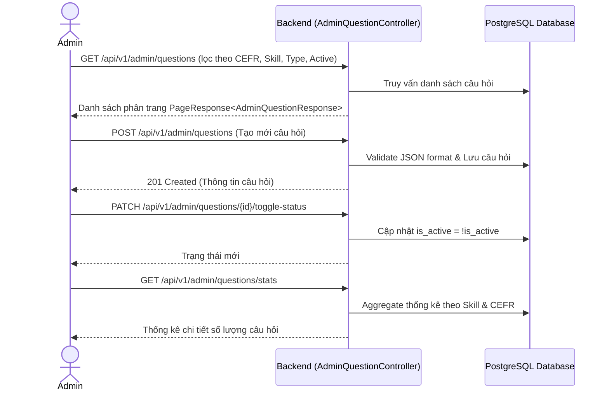
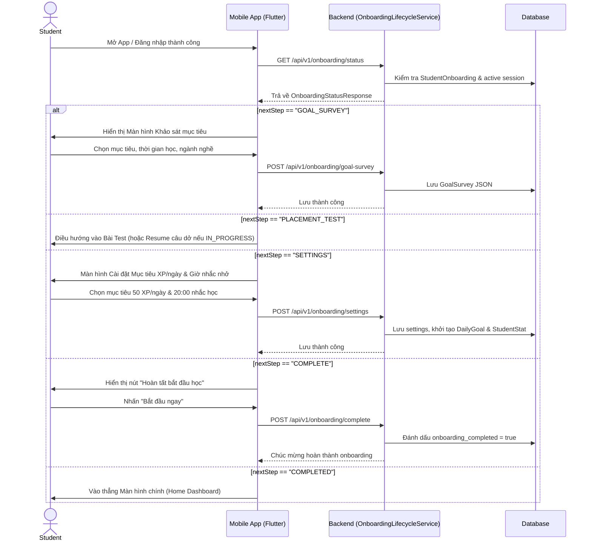
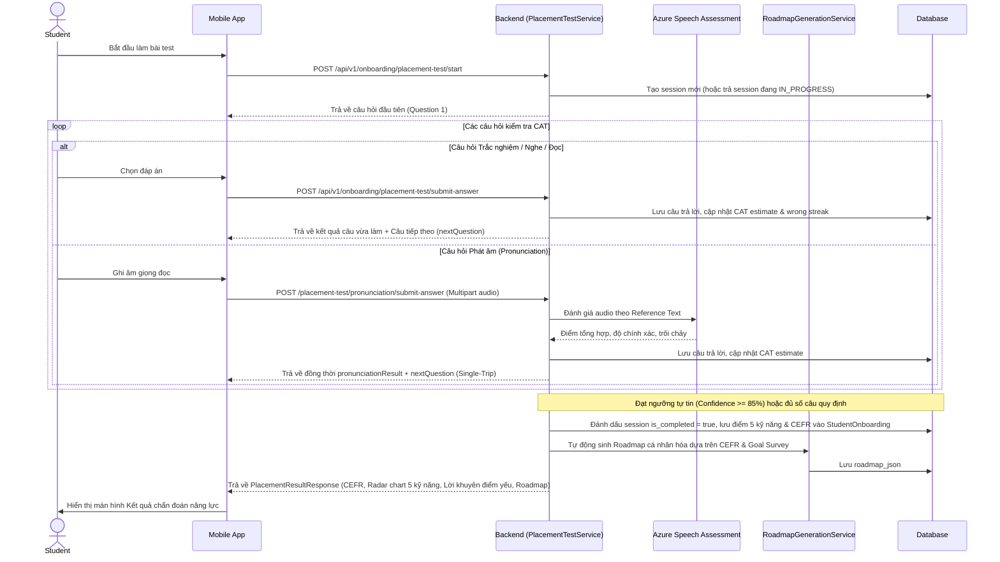
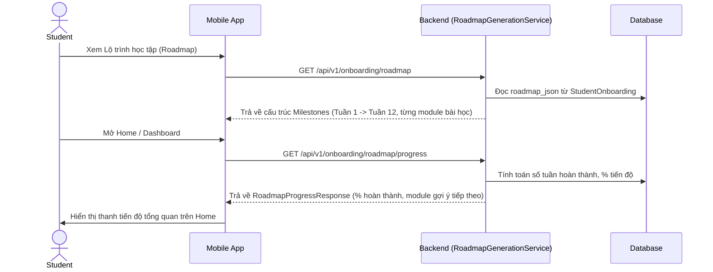

# Kiến trúc Luồng Xử Lý (Flow Architecture) - Module 0

*Tài liệu mô tả ĐẦY ĐỦ các luồng nghiệp vụ chuẩn và Đặc tả API (API Specification) chi tiết nhất cho hệ thống Onboarding, Khảo sát mục tiêu, Bài kiểm tra phân loại thích ứng (Adaptive CAT Placement Test) và Sinh lộ trình học tập (Roadmap).*

---

## 1. Luồng Quản trị Ngân hàng Câu hỏi Phân loại (Admin Flow)
Admin quản lý ngân hàng câu hỏi trắc nghiệm và phát âm, phân loại theo độ khó CEFR (A1 - C2), kỹ năng và kích hoạt/vô hiệu hóa câu hỏi.



### 📦 Đặc tả API tương ứng (AdminQuestionController)

#### 1.1 Quản trị Ngân hàng câu hỏi
- **`GET /api/v1/admin/questions`**: Lấy danh sách câu hỏi có phân trang & bộ lọc.
  - **Query Params:** `cefrLevel` (A1..C2), `skill` (VOCABULARY, GRAMMAR, READING, LISTENING, PRONUNCIATION), `questionType` (MULTIPLE_CHOICE, FILL_IN_BLANK, AUDIO_CHOICE, PRONUNCIATION), `isActive` (boolean), `page`, `size`.
- **`POST /api/v1/admin/questions`**: Tạo mới câu hỏi.
  - **Body (JSON):**
    ```json
    {
      "cefrLevel": "A2",
      "skill": "PRONUNCIATION",
      "questionType": "PRONUNCIATION",
      "timeoutSeconds": 30,
      "correctAnswer": "schedule",
      "content": {
        "word": "schedule",
        "ipaTranscription": "/ˈskedʒ.uːl/",
        "instruction": "Đọc to từ bên dưới vào microphone"
      }
    }
    ```
- **`PUT /api/v1/admin/questions/{id}`**: Cập nhật nội dung câu hỏi.
- **`PATCH /api/v1/admin/questions/{id}/toggle-status`**: Bật/tắt trạng thái kích hoạt.
- **`GET /api/v1/admin/questions/stats`**: Thống kê số lượng câu hỏi khả dụng theo từng kỹ năng và level.

---

## 2. Luồng Vòng đời Onboarding & Ma trận Điều hướng (State Machine Flow)
Quy trình hướng dẫn học viên qua các bước bắt buộc khi mới đăng ký tài khoản. Hệ thống thực thi cơ chế State Machine bất biến (Invariant), ngăn ngừa hoàn toàn tình trạng loop màn hình.



### 📋 Ma trận Chuyển đổi Trạng thái Bất biến (State Invariants)

| `placementTestStatus` | `goalDone` | `settingsDone` | `isCompleted` | `nextStep` trả về | `stepNumber` | Màn hình Mobile điều hướng đến |
|---|:---:|:---:|:---:|---|:---:|---|
| `NOT_STARTED` | `false` | `false` | `false` | `"GOAL_SURVEY"` | 1 | Màn hình Khảo sát mục tiêu |
| `NOT_STARTED` | `true` | `false` | `false` | `"PLACEMENT_TEST"` | 2 | Màn hình Bắt đầu làm bài Test |
| `IN_PROGRESS` | *bất kỳ* | *bất kỳ* | `false` | `"PLACEMENT_TEST"` | 2 | Màn hình Tiếp tục làm bài test dở (`activePlacementSessionId`) |
| `COMPLETED` / `SKIPPED` | `false` | `false` | `false` | `"GOAL_SURVEY"` | 1 | Màn hình Khảo sát mục tiêu |
| `COMPLETED` / `SKIPPED` | `true` | `false` | `false` | `"SETTINGS"` | 4 | Màn hình Cài đặt mục tiêu (XP & Giờ nhắc) |
| `COMPLETED` / `SKIPPED` | `true` | `true` | `false` | `"COMPLETE"` | 4 | Dialog / Nút xác nhận "Hoàn tất Onboarding" |
| `COMPLETED` / `SKIPPED` | `true` | `true` | `true` | `"COMPLETED"` | 5 | Màn hình chính (Home/Dashboard) |

### 📦 Đặc tả API tương ứng (OnboardingController)

#### 2.1 Kiểm tra trạng thái Onboarding
- **`GET /api/v1/onboarding/status`**:
  - **Headers:** `Authorization: Bearer <accessToken>`
  - **Response (200 OK):**
    ```json
    {
      "code": 1000,
      "message": "Thành công",
      "data": {
        "goalSurveyCompleted": true,
        "placementTestCompleted": false,
        "settingsCompleted": false,
        "onboardingCompleted": false,
        "placementTestStatus": "IN_PROGRESS",
        "activePlacementSessionId": 108,
        "nextStep": "PLACEMENT_TEST",
        "stepNumber": 2,
        "totalSteps": 5,
        "userName": "Phan Thanh Sơn",
        "placementCefrLevel": null,
        "dailyGoalXp": null,
        "roadmapGenerated": false
      }
    }
    ```

#### 2.2 Nộp khảo sát mục tiêu (Goal Survey)
- **`POST /api/v1/onboarding/goal-survey`**:
  - **Body (JSON):**
    ```json
    {
      "targetLevel": "B2",
      "dailyTimeCommitmentMinutes": 30,
      "learningReason": "CAREER",
      "learningStyle": "VISUAL",
      "occupation": "SOFTWARE_ENGINEER"
    }
    ```

#### 2.3 Lưu cài đặt mục tiêu (Settings)
- **`POST /api/v1/onboarding/settings`**:
  - **Body (JSON):**
    ```json
    {
      "dailyGoalXp": 50,
      "reminderTime": "20:00"
    }
    ```

#### 2.4 Hoàn thành Onboarding
- **`POST /api/v1/onboarding/complete`**:
  - **Response (200 OK):** `{"code": 1000, "message": "Chúc mừng bạn đã hoàn thành onboarding!"}`

---

## 3. Luồng Kiểm tra Phân loại Trình độ Thích ứng (Adaptive CAT Placement Test Flow)
Quy trình làm bài kiểm tra thích ứng máy tính (Computerized Adaptive Testing - CAT). Độ khó câu hỏi tự động tăng/giảm theo từng câu trả lời đúng/sai để xác định chính xác trình độ CEFR (A1 - C2) với số lượng câu tối thiểu.



### 📦 Đặc tả API tương ứng (OnboardingController)

#### 3.1 Bắt đầu bài kiểm tra (Start / Resume Idempotent)
- **`POST /api/v1/onboarding/placement-test/start`**:
  - Tự động phát hiện session còn hạn để học viên tiếp tục làm dở mà không bị mất tiến trình.

#### 3.2 Nộp câu trả lời trắc nghiệm (Structured Progression)
- **`POST /api/v1/onboarding/placement-test/submit-answer`**:
  - **Body (JSON):**
    ```json
    {
      "sessionId": 108,
      "questionId": 25,
      "answerGiven": "B",
      "timeSpentMs": 12400
    }
    ```
  - **Response (200 OK - Khi còn câu tiếp theo):**
    ```json
    {
      "code": 1000,
      "data": {
        "sessionId": 108,
        "submittedQuestionId": 25,
        "sessionStatus": "IN_PROGRESS",
        "previousAnswerCorrect": true,
        "previousCorrectAnswer": "B",
        "questionId": 26,
        "questionIndex": 4,
        "totalQuestions": 30,
        "cefrLevel": "B1",
        "skill": "GRAMMAR",
        "questionType": "MULTIPLE_CHOICE",
        "timeoutSeconds": 45,
        "content": {
          "question": "If I _____ you, I would study harder.",
          "options": ["was", "were", "am", "be"]
        },
        "nextQuestion": {
          "questionId": 26,
          "questionIndex": 4,
          "totalQuestions": 30,
          "cefrLevel": "B1",
          "skill": "GRAMMAR",
          "questionType": "MULTIPLE_CHOICE",
          "timeoutSeconds": 45,
          "content": { ... }
        },
        "isTestCompleted": false,
        "placementResult": null
      }
    }
    ```

#### 3.3 Nộp câu trả lời phát âm (Single-Trip Pronunciation Progression)
- **`POST /api/v1/onboarding/placement-test/pronunciation/submit-answer`**:
  - **Content-Type:** `multipart/form-data`
  - **Params:** `sessionId` (Long), `questionId` (Long), `audioFile` (File WAV/WebM/OGG, <= 5MB), `word` (String), `wordIndex` (int).
  - **Response (200 OK):**
    ```json
    {
      "code": 1000,
      "data": {
        "sessionId": 108,
        "submittedQuestionId": 28,
        "sessionStatus": "IN_PROGRESS",
        "pronunciationResult": {
          "word": "comfortable",
          "overallScore": 86,
          "accuracyScore": 88,
          "fluencyScore": 84,
          "completenessScore": 100,
          "scoreColor": "GREEN",
          "scoreLevel": "EXCELLENT",
          "status": "SCORED"
        },
        "nextQuestion": {
          "questionId": 29,
          "questionIndex": 6,
          "totalQuestions": 30,
          "cefrLevel": "B1",
          "skill": "LISTENING",
          "questionType": "AUDIO_CHOICE"
        },
        "isTestCompleted": false,
        "placementResult": null
      }
    }
    ```

#### 3.4 Bỏ qua bài kiểm tra (Fast-Track Onboarding cho người mới bắt đầu)
- **`POST /api/v1/onboarding/placement-test/skip`**:
  - Gán ngay trình độ mặc định `A1`, điểm sàn 20/100 cho 5 kỹ năng, và tự động sinh lộ trình tuần 1.

#### 3.5 Xem kết quả bài kiểm tra
- **`GET /api/v1/onboarding/placement-test/result`**:
  - Trả về điểm số 5 kỹ năng (để render Radar chart), phân loại CEFR, danh sách lời khuyên điểm yếu cá nhân hóa bằng tiếng Việt (`diagnosticTips`).

---

## 4. Luồng Lộ trình Học tập Cá nhân hóa (Roadmap Flow)
Quy trình sinh và theo dõi tiến độ lộ trình học tập tự động sau bài kiểm tra phân loại.



### 📦 Đặc tả API tương ứng
- **`GET /api/v1/onboarding/roadmap`**: Lấy chi tiết toàn bộ các mốc tuần học (Milestones) và danh sách bài học (Modules).
- **`GET /api/v1/onboarding/roadmap/progress`**: Lấy thống kê tổng quát:
  ```json
  {
    "code": 1000,
    "data": {
      "cefrLevel": "B1",
      "totalWeeks": 12,
      "completedWeeks": 0,
      "currentWeek": 1,
      "totalModules": 48,
      "completedModules": 0,
      "percentCompleted": 0.0,
      "nextSuggestedModule": "Nguyên âm đơn /iː/ và /ɪ/"
    }
  }
  ```
