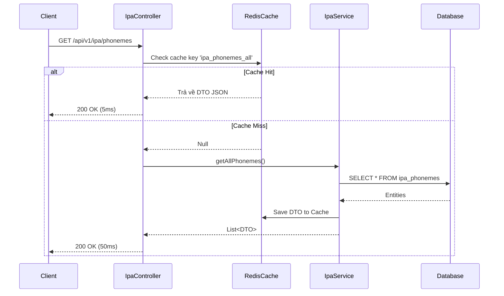

# PHASE 1: IPA SOUND LIBRARY & CACHING STRATEGY

Phase 1 không chỉ là xây dựng các API CRUD cơ bản, mà còn áp dụng các pattern tối ưu hoá hiệu năng (Caching) để xử lý lượng request lớn khi hệ thống scale.

## 1. Yêu cầu Hệ thống (System Requirements)

- **Listing API**: Cung cấp danh sách 44 âm vị (Lọc theo VOWEL/CONSONANT, mức độ khó, lỗi phổ biến). Phải được Cache.
- **Detail API**: Trả về thông tin chi tiết một âm vị bao gồm từ ví dụ. Tối ưu hoá truy vấn để tránh N+1 Query.
- **Bookmark API**: Lưu trữ âm vị yêu thích (Upsert logic).

## 2. Kiến trúc Luồng Dữ Liệu (Sequence Diagram)



## 3. Thiết kế Dữ liệu & Tối ưu hoá Truy vấn

**Vấn đề N+1 Query:**
Khi gọi Detail API lấy 1 âm vị và danh sách các từ ví dụ (`IpaExampleWord`), ta cần cấu hình `@EntityGraph` hoặc viết JPQL FETCH JOIN để kéo toàn bộ dữ liệu trong 1 câu SQL duy nhất.

```java
// Trong IpaPhonemeRepository.java
@Query("SELECT p FROM IpaPhoneme p LEFT JOIN FETCH p.exampleWords WHERE p.id = :id")
Optional<IpaPhoneme> findByIdWithWords(@Param("id") Short id);
```

**Công việc Migration & Seeding:**
- Tạo script Flyway `V8__seed_ipa_data.sql`. Seed trước khoảng 5 âm vị cơ bản (vd: `/iː/`, `/ɪ/`, `/p/`, `/b/`, `/ʃ/`) và 10 từ ví dụ. 

## 4. Thiết kế DTOs (Data Transfer Objects)

Cấu trúc DTO cần Serializable để lưu được vào Redis:

```java
@Data
@Builder
public class IpaPhonemeResponse implements Serializable {
  private Short id;
  private String symbol;
  private PhonemeType phonemeType;
  private String nameVi;
  private String audioMaleUrl;
  private String audioFemaleUrl;
  private Boolean isCommonVnError;
  private CefrLevel cefrIntroLevel;
}
```

*Tương tự cho `IpaExampleWordResponse` và `IpaPhonemeDetailResponse`.*

## 5. API Endpoints Contract

### 5.1 GET `/api/v1/ipa/phonemes`
- **Cache Name:** `ipa_phonemes` (Key tự động theo params).
- **Response:** `200 OK` (Cấu trúc mảng `IpaPhonemeResponse`).

### 5.2 GET `/api/v1/ipa/phonemes/{id}`
- **Cache Name:** `ipa_phoneme_detail` (Key: `#id`).
- **Response:** `200 OK` (Cấu trúc `IpaPhonemeDetailResponse`).

### 5.3 POST `/api/v1/ipa/phonemes/{id}/bookmark`
- **Auth:** JWT required.
- **Logic:** Kiểm tra tồn tại trong `StudentPhonemeBookmarkRepository`. Có thì xoá, chưa có thì tạo (Toggle).
- **Response:** `200 OK`.

## 6. Các Component Cần Xây Dựng (Implementation Steps)

1.  **Enable Caching:** Thêm `@EnableCaching` ở main class, config Redis properties trong `application-local.yaml`.
2.  **Repository Layer:** `IpaPhonemeRepository` (kèm FETCH JOIN), `IpaExampleWordRepository`, `StudentPhonemeBookmarkRepository`.
3.  **Service Layer:** Tích hợp các annotation `@Cacheable`.
4.  **Database Migration:** Triển khai `V8__seed_ipa_data.sql`.
