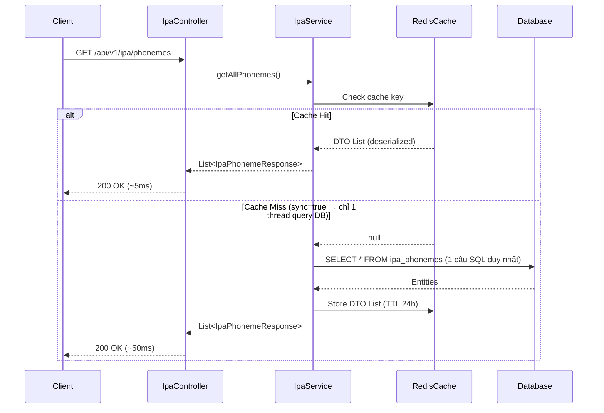

# PHASE 1: IPA SOUND LIBRARY & CACHING STRATEGY

Phase 1 xây dựng các API thư viện IPA và áp dụng caching strategy chống Cache Stampede để đảm bảo hiệu năng khi scale.

## 1. Yêu cầu Hệ thống (System Requirements)

- **Listing API**: Danh sách 44 âm vị (lọc theo VOWEL/CONSONANT, mức độ khó, lỗi phổ biến). Phải được cache với `sync=true`.
- **Detail API**: Thông tin chi tiết âm vị + từ ví dụ. Tối ưu hoá bằng FETCH JOIN để tránh N+1 Query.
- **Bookmark API**: Toggle bookmark âm vị yêu thích (Upsert/Delete logic).

## 2. Kiến trúc Luồng Dữ Liệu (Sequence Diagram)

> ⚠️ **Lưu ý triển khai:** Spring Cache là transparent — Controller không trực tiếp tương tác với Redis. Cache được xử lý tự động ở tầng Service qua AOP. Diagram dưới đây thể hiện luồng logic, không phải code call.



## 3. Thiết kế Dữ liệu & Tối ưu hoá Truy vấn

### 3.1 Chống N+1 Query
Dùng JPQL FETCH JOIN thay vì lazy loading khi lấy Detail:
```java
// IpaPhonemeRepository.java
@Query("SELECT p FROM IpaPhoneme p LEFT JOIN FETCH p.exampleWords WHERE p.id = :id")
Optional<IpaPhoneme> findByIdWithWords(@Param("id") Short id);
```

### 3.2 Flyway Migration: V8__seed_ipa_data.sql
Seed 5 âm vị cơ bản (`/iː/`, `/ɪ/`, `/p/`, `/b/`, `/ʃ/`) và 10 từ ví dụ phục vụ test.
Đồng thời tạo **GIN Index** cho `phoneme_detail_json` để hỗ trợ query thống kê về sau:
```sql
-- Seed IPA Phonemes
INSERT INTO ipa_phonemes (symbol, phoneme_type, name_vi, audio_male_url, audio_female_url, cefr_intro_level, is_common_vn_error)
VALUES
  ('iː', 'VOWEL', 'Âm i dài', '...', '...', 'A1', false),
  ('ɪ',  'VOWEL', 'Âm i ngắn', '...', '...', 'A1', true),
  ('p',  'CONSONANT', 'Âm p', '...', '...', 'A1', false),
  ('b',  'CONSONANT', 'Âm b', '...', '...', 'A1', false),
  ('ʃ',  'CONSONANT', 'Âm sh', '...', '...', 'A2', true);

-- GIN Index cho query thống kê JSONB sau này
-- (Tạo sẵn ngay từ đầu để không phải migrate lại khi DB đã có hàng triệu row)
CREATE INDEX idx_practice_log_phoneme
    ON pronunciation_practice_logs USING GIN (phoneme_detail_json);
```

## 4. Thiết kế DTOs

> ⚠️ **Bắt buộc implement `Serializable` + khai báo `serialVersionUID`** để tránh `InvalidClassException` khi deploy phiên bản mới mà Redis đang giữ cache cũ.

```java
@Data
@Builder
public class IpaPhonemeResponse implements Serializable {
    // Bắt buộc: tránh InvalidClassException khi rolling update
    private static final long serialVersionUID = 1L;

    private Short id;
    private String symbol;
    private PhonemeType phonemeType;
    private String nameVi;
    private String audioMaleUrl;
    private String audioFemaleUrl;
    private Boolean isCommonVnError;
    private CefrLevel cefrIntroLevel;
}

@Data
@Builder
public class IpaExampleWordResponse implements Serializable {
    private static final long serialVersionUID = 1L;

    private Long id;
    private String word;
    private String ipaTranscription;
    private String audioUrl;
}

@Data
@Builder
public class IpaPhonemeDetailResponse implements Serializable {
    private static final long serialVersionUID = 1L;

    private Short id;
    private String symbol;
    private PhonemeType phonemeType;
    private String nameVi;
    private String audioMaleUrl;
    private String audioFemaleUrl;
    private String videoMouthUrl;
    private Boolean isCommonVnError;
    private CefrLevel cefrIntroLevel;
    private List<IpaExampleWordResponse> exampleWords;
}
```

## 5. API Endpoints Contract

### 5.1 GET `/api/v1/ipa/phonemes`
- **Auth:** Không bắt buộc (public endpoint).
- **Query Params:** `type` (VOWEL, CONSONANT — optional), `isCommonError` (boolean — optional).
- **Cache:** `@Cacheable(value = "ipa_phonemes", sync = true)` — key tự sinh theo params.
- **Response:** `200 OK`
```json
{
  "code": 200,
  "data": [
    {
      "id": 1,
      "symbol": "iː",
      "phonemeType": "VOWEL",
      "nameVi": "Âm i dài",
      "audioMaleUrl": "https://cdn.../phonemes/ii_male.mp3",
      "audioFemaleUrl": "https://cdn.../phonemes/ii_female.mp3",
      "isCommonVnError": false,
      "cefrIntroLevel": "A1"
    }
  ]
}
```

### 5.2 GET `/api/v1/ipa/phonemes/{id}`
- **Auth:** Không bắt buộc (public endpoint).
- **Cache:** `@Cacheable(value = "ipa_phoneme_detail", key = "#id", sync = true)`.
- **Response:** `200 OK`
```json
{
  "code": 200,
  "data": {
    "id": 1,
    "symbol": "iː",
    "phonemeType": "VOWEL",
    "nameVi": "Âm i dài",
    "videoMouthUrl": "https://cdn.../phonemes/ii_mouth.mp4",
    "exampleWords": [
      {
        "id": 10,
        "word": "sheep",
        "ipaTranscription": "/ʃiːp/",
        "audioUrl": "https://cdn.../words/sheep.mp3"
      }
    ]
  }
}
```

### 5.3 POST `/api/v1/ipa/phonemes/{id}/bookmark`
- **Auth:** JWT required (lấy `userId` từ SecurityContext).
- **Logic:** Toggle — nếu đã bookmark thì xoá, chưa có thì tạo mới.
- **Note:** `exampleWordId` phục vụ Practice API là ID của `IpaExampleWord.word` (từ để đọc), không phải `IpaPhoneme.id`. Backend lấy `IpaExampleWord.word` làm `referenceText` gửi Azure.
- **Response:** `200 OK`
```json
{
  "code": 200,
  "data": { "isBookmarked": true }
}
```

## 6. Implementation Steps

1. **Config file size limit** (application.yaml — làm trước mọi thứ):
   ```yaml
   spring:
     servlet:
       multipart:
         max-file-size: 5MB
         max-request-size: 6MB
   ```
2. **Enable Caching** — thêm `@EnableCaching` tại `DemoApplication.java`, config Redis connection pool trong `application-local.yaml`.
3. **Repository Layer** — `IpaPhonemeRepository` (FETCH JOIN), `IpaExampleWordRepository`, `StudentPhonemeBookmarkRepository`.
4. **Service Layer** — `IpaService` với `@Cacheable(sync = true)`.
5. **Controller Layer** — `IpaController`.
6. **Database Migration** — `V8__seed_ipa_data.sql` (bao gồm seed data + GIN Index).
