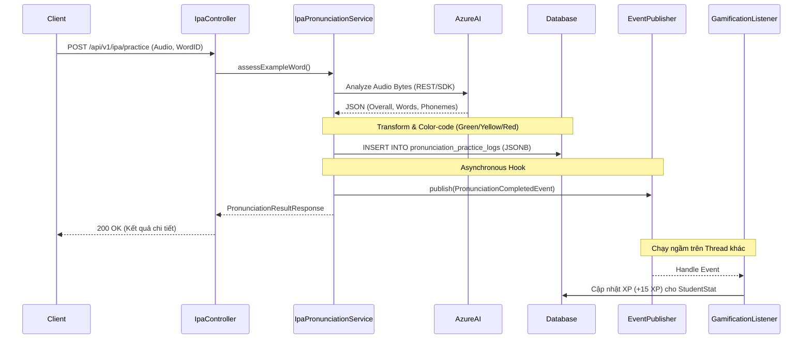

# PHASE 2: AI ASSESSMENT ENGINE & EVENT-DRIVEN GAMIFICATION

Phase 2 là tính năng phức tạp nhất của Module 1, yêu cầu xử lý file audio, tương tác với Azure AI, lưu trữ JSON phức tạp và trigger các tác vụ nền (background tasks) một cách an toàn.

## 1. Kiến trúc Luồng Xử Lý (Sequence Diagram)

Sử dụng pattern **Event-Driven** để decouple (tách rời) logic tính điểm phát âm và logic cộng XP của người dùng, giúp API phản hồi nhanh nhất có thể.



## 2. Thiết kế Dữ liệu & Color Coding (JSONB)

**Logic phân loại màu (Color Coding) trên Backend:**
Việc này sẽ giảm tải logic cho Frontend, Backend sẽ tự map mức điểm của Azure thành Enum Màu Sắc:
- Điểm $\ge$ 80: `GREEN` (Chính xác)
- Điểm $\ge$ 60 và $<$ 80: `YELLOW` (Tạm ổn, cần sửa nhẹ)
- Điểm $<$ 60: `RED` (Cần sửa ngay)

Dữ liệu JSONB lưu vào cột `phoneme_detail_json`:
```json
[
  {
    "phoneme": "ʃ",
    "accuracyScore": 95,
    "color": "GREEN"
  },
  {
    "phoneme": "iː",
    "accuracyScore": 55,
    "color": "RED"
  }
]
```

## 3. Thiết kế DTOs và Events

**Event Object (Dùng cho EventPublisher):**
```java
@Getter
@AllArgsConstructor
public class PronunciationCompletedEvent {
    private final Long studentId;
    private final int xpReward;
    private final Long logId;
}
```

**Response DTO:**
```java
@Data
@Builder
public class PronunciationResultResponse {
  private Short overallScore;
  private Short fluencyScore;
  private Short completenessScore;
  private Boolean stressCorrect;
  private List<PhonemeScoreDto> phonemes;
}
```

## 4. API Endpoints Contract

### 4.1 POST `/api/v1/ipa/practice`
- **Auth:** JWT required.
- **Content-Type:** `multipart/form-data`
- **Request Parameters:**
  - `exampleWordId` (Long): Id của từ ví dụ cần luyện.
  - `audio` (MultipartFile): File ghi âm.
- **Validation:** 
  - Backend phải check *Magic Bytes* của file audio để đảm bảo đây thực sự là file âm thanh (chặn hack upload malware). Kế thừa hàm validate từ Phase 3 Module 0.
- **Response:** `200 OK` (Cấu trúc `PronunciationResultResponse`).

## 5. Các Component Cần Xây Dựng (Implementation Steps)

1.  **Database Config:** Xác nhận thư viện `hibernate-types` (vladmihalcea) hoặc chuẩn JSONB của Spring Data 3.x đang hoạt động đúng.
2.  **Service Layer (`IpaPronunciationService`):**
    - Gọi sang `AzureAudioAnalysisService` (đã viết).
    - Map kết quả JSON từ Azure thành list `PhonemeScoreDto`.
    - Tính toán điểm stress (trọng âm) nếu từ ví dụ có $>1$ âm tiết.
    - Lưu object `PronunciationPracticeLog`.
    - Publish `PronunciationCompletedEvent`.
3.  **Gamification Listener:**
    - Tạo `PronunciationEventListener` sử dụng `@Async` và `@EventListener`.
    - Inject `StudentStatRepository` để update XP.
4.  **Error Handling (Kiến trúc an toàn):**
    - Tạo `AudioProcessingException` nếu Azure sập/timeout (Tránh quăng 500 bừa bãi, trả về mã HTTP 502 Bad Gateway).
