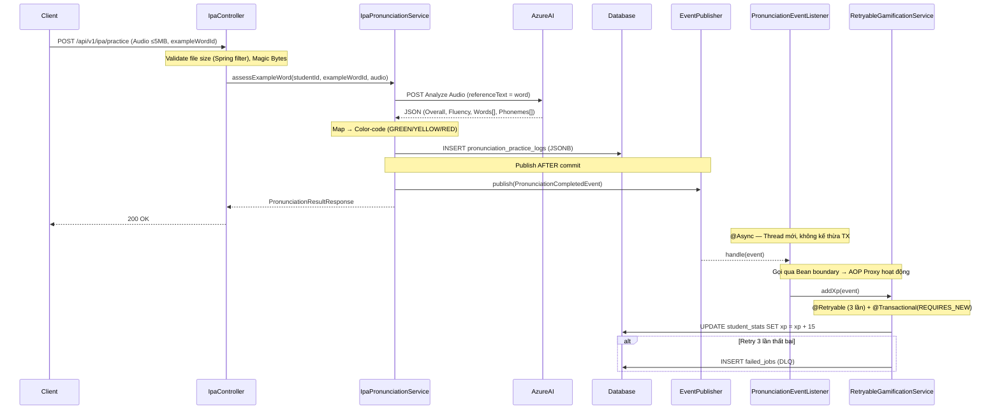

# PHASE 2: AI ASSESSMENT ENGINE & EVENT-DRIVEN GAMIFICATION

Phase 2 xử lý file audio, tích hợp Azure AI, lưu trữ JSONB và trigger gamification bất đồng bộ một cách an toàn. Đây là phase phức tạp nhất — có nhiều pitfall kiến trúc cần tuân thủ nghiêm ngặt.

---

## 1. Kiến trúc Luồng Xử Lý (Sequence Diagram)



---

## 2. Thiết kế Dữ liệu & Color Coding (JSONB)

**Logic phân loại màu — Backend tính toán sẵn, Frontend chỉ render:**

| Điểm Azure | Enum | Ý nghĩa |
|---|---|---|
| ≥ 80 | `GREEN` | Chính xác |
| 60 – 79 | `YELLOW` | Tạm ổn, cần sửa nhẹ |
| < 60 | `RED` | Cần sửa ngay |

**Cấu trúc JSONB lưu vào `phoneme_detail_json`:**
```json
[
  { "phoneme": "ʃ",  "accuracyScore": 95, "color": "GREEN"  },
  { "phoneme": "iː", "accuracyScore": 55, "color": "RED"    },
  { "phoneme": "p",  "accuracyScore": 72, "color": "YELLOW" }
]
```

---

## 3. Thiết kế DTOs & Events

### Event Object
```java
@Getter
@AllArgsConstructor
public class PronunciationCompletedEvent {
    private final Long studentId;
    private final int xpReward;   // 10-20 XP tuỳ ngưỡng điểm overall
    private final Long logId;     // Dùng để trace trong DLQ nếu cần reprocess
}
```

### Response DTO
```java
@Data
@Builder
public class PronunciationResultResponse {
    private Short overallScore;
    private Short fluencyScore;
    private Short completenessScore;
    private Boolean stressCorrect;
    private List<PhonemeScoreDto> phonemes;
}

@Data
@Builder
public class PhonemeScoreDto {
    private String phoneme;
    private Short accuracyScore;
    private String color;   // "GREEN" | "YELLOW" | "RED"
}
```

---

## 4. API Endpoints Contract

### 4.1 POST `/api/v1/ipa/practice`
- **Auth:** JWT required.
- **Content-Type:** `multipart/form-data`
- **Request Parameters:**
  - `exampleWordId` (Long): ID của `IpaExampleWord` cần luyện. Backend tự lấy `IpaExampleWord.word` làm `referenceText` gửi Azure — Client **không** cần truyền text.
  - `audio` (MultipartFile): File ghi âm (wav, ogg, webm). **Giới hạn 5MB** — từ chối ở tầng Spring filter trước khi vào Controller.
- **Validation bắt buộc:**
  - **File size:** Config `spring.servlet.multipart.max-file-size=5MB` — filter từ chối trước khi OOM xảy ra.
  - **Magic Bytes:** Kiểm tra header bytes của file để xác định đúng định dạng audio hợp lệ. Tái sử dụng hàm validate từ `AzureAudioAnalysisService` (Module 0 Phase 3).
- **Error codes:**
  - `400 Bad Request` — file format không hợp lệ hoặc `exampleWordId` không tồn tại.
  - `502 Bad Gateway` — Azure AI sập hoặc timeout (throw `AudioProcessingException`).
- **Response:** `200 OK`
```json
{
  "code": 200,
  "data": {
    "overallScore": 85,
    "fluencyScore": 90,
    "completenessScore": 100,
    "stressCorrect": true,
    "phonemes": [
      { "phoneme": "ʃ",  "accuracyScore": 95, "color": "GREEN"  },
      { "phoneme": "iː", "accuracyScore": 72, "color": "YELLOW" }
    ]
  }
}
```

---

## 5. Implementation Steps & Pitfall Warnings

### 5.1 Config bắt buộc trước khi code (application.yaml)
```yaml
spring:
  servlet:
    multipart:
      max-file-size: 5MB
      max-request-size: 6MB
```
> ⚠️ **Nếu thiếu config này:** User upload file 500MB → JVM OOM **trước khi** Magic Byte check kịp chạy → Production crash.

### 5.2 Service Layer: `IpaPronunciationService`
- Lookup `IpaExampleWord` theo `exampleWordId` → lấy `.word` làm `referenceText`.
- Validate Magic Bytes (reuse từ `AzureAudioAnalysisService`).
- Gọi Azure API, nhận JSON response.
- Map `Words[].Phonemes[]` từ Azure → List `PhonemeScoreDto` với color-code.
- INSERT `PronunciationPracticeLog` (JSONB).
- Publish `PronunciationCompletedEvent` **sau khi INSERT thành công**.

### 5.3 Gamification: `PronunciationEventListener` + `RetryableGamificationService`

> ⚠️ **AOP Proxy Pitfall:** `@Retryable` hoạt động qua AOP Proxy. Nếu gắn `@Retryable` trực tiếp lên method trong cùng Bean với `@Async`, Spring **bypass Proxy** → Retry không bao giờ chạy dù exception xảy ra. **Bắt buộc tách thành 2 Bean riêng biệt.**

> ⚠️ **Transaction Boundary:** `@Async` tạo thread mới — thread đó **không kế thừa transaction** của Service gọi. `RetryableGamificationService` phải tự khai báo `@Transactional(propagation = REQUIRES_NEW)`.

```java
// Bean 1: PronunciationEventListener — chỉ dispatch, không retry
@Component
public class PronunciationEventListener {

    @Autowired
    private RetryableGamificationService retryableGamificationService;

    @Async                      // Thread mới, không kế thừa TX
    @EventListener
    public void handle(PronunciationCompletedEvent event) {
        retryableGamificationService.addXp(event);  // Gọi qua Bean boundary → AOP Proxy hoạt động
    }
}

// Bean 2: RetryableGamificationService — chứa @Retryable + @Transactional
@Service
public class RetryableGamificationService {

    @Retryable(
        value = { TransientDataAccessException.class, CannotAcquireLockException.class },
        maxAttempts = 3,
        backoff = @Backoff(delay = 1000, multiplier = 2)  // 1s → 2s → 4s
    )
    @Transactional(propagation = Propagation.REQUIRES_NEW)  // TX độc lập
    public void addXp(PronunciationCompletedEvent event) {
        // UPDATE student_stats SET xp = xp + event.getXpReward()
    }

    @Recover
    public void recover(Exception e, PronunciationCompletedEvent event) {
        log.error("[DLQ] Không thể cộng {} XP cho User {} sau 3 lần retry. logId={}",
                  event.getXpReward(), event.getStudentId(), event.getLogId(), e);
        // INSERT vào bảng failed_jobs để Cron Job xử lý lại sau
        deadLetterQueueService.save(event);
    }
}
```

### 5.4 Cơ chế Fault Tolerance 2 lớp (Tóm tắt)

| Lớp | Cơ chế | Kịch bản |
|---|---|---|
| **Lớp 1 — Transient** | `@Retryable` (3 lần, exponential backoff 1s/2s/4s) | Deadlock thoáng qua, connection pool timeout |
| **Lớp 2 — Persistent** | `@Recover` → INSERT `failed_jobs` + Cron Job 2h sáng | DB sập kéo dài, lỗi không hồi phục |

> **Tại sao không dùng Transactional Outbox Pattern?** Gamification XP không phải dữ liệu tài chính cốt lõi. Outbox Pattern sẽ phức tạp hoá quá mức cần thiết (over-engineering). Cơ chế Retry + DLQ đạt cân bằng tốt giữa độ an toàn và chi phí bảo trì.

### 5.5 Testing

- **Transaction Isolation Test:** Giả lập Listener throw exception sau khi INSERT log → xác nhận bản ghi `pronunciation_practice_logs` vẫn tồn tại (không bị rollback cùng).
- **Retry Verification Test:** Mock `CannotAcquireLockException` trong `RetryableGamificationService` → quan sát log để xác nhận Spring retry đúng 3 lần trước khi gọi `@Recover`.
- **OOM/Security Test:** Upload file > 5MB → xác nhận `MaxUploadSizeExceededException` trả về `400`, không reach Controller.
- **JSONB Integrity Test:** Sau khi practice, query DB kiểm tra `phoneme_detail_json` là valid JSON (dùng `jsonb_typeof()` trên PostgreSQL).
