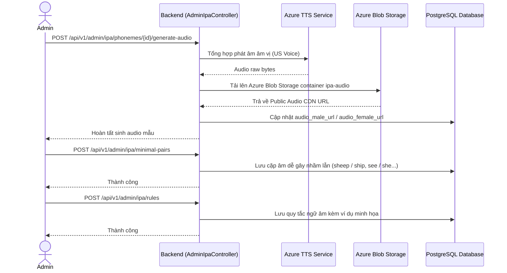
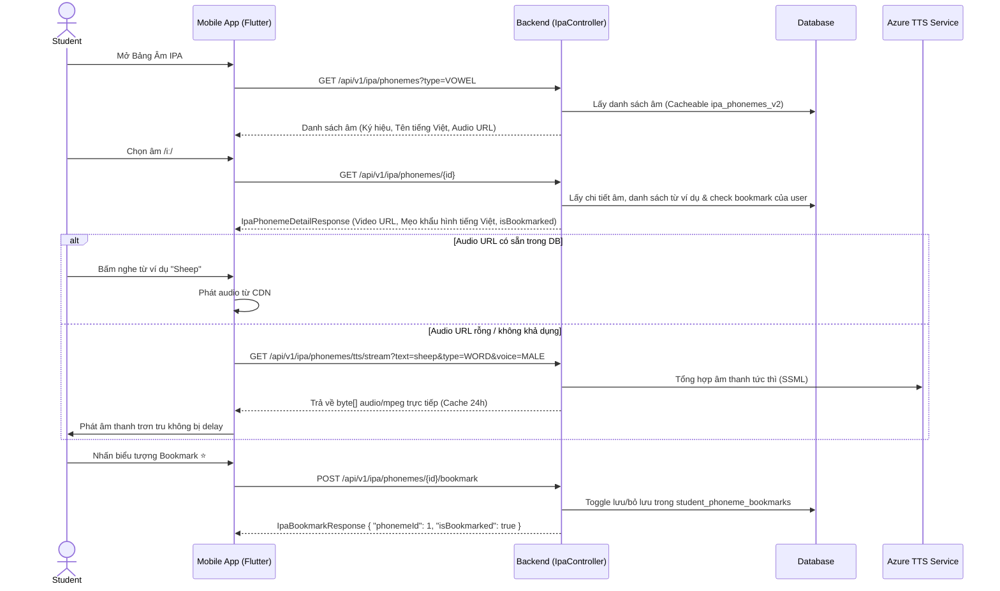
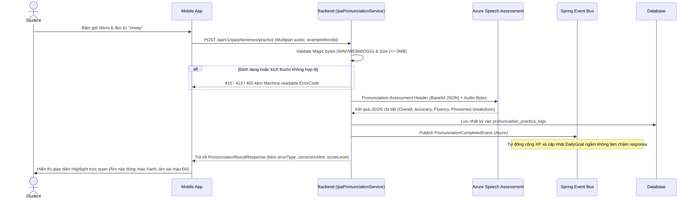
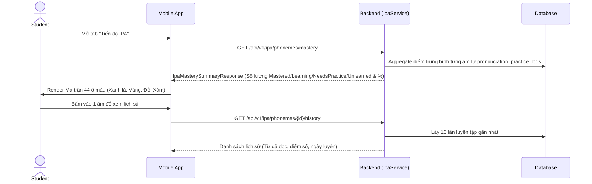

# Kiến trúc Luồng Xử Lý (Flow Architecture) - Module 1

*Tài liệu mô tả ĐẦY ĐỦ các luồng nghiệp vụ chuẩn và Đặc tả API (API Specification) chi tiết nhất cho hệ thống Học Phát Âm IPA, Cặp âm Dễ nhầm lẫn (Minimal Pairs), Quy tắc Ngữ âm (Pronunciation Rules), Chấm điểm Phát âm AI (Azure Speech Assessment Engine), Bảng nhiệt độ thành thạo (Mastery Heatmap) & Bookmark.*

---

## 1. Luồng Quản trị Âm IPA, Từ Ví Dụ & Quy tắc Ngữ Âm (Admin Flow)
Quy trình Admin quản trị dữ liệu 44 âm IPA, cấu hình video khẩu hình miệng, từ ví dụ kèm phát âm, cặp âm tối thiểu (Minimal Pairs) và tự động sinh Audio mẫu chuẩn bằng Azure TTS.



### 📦 Đặc tả API tương ứng (AdminIpaController)

#### 1.1 Quản trị Âm IPA & Ví dụ
- **`GET /api/v1/admin/ipa/phonemes`**: Danh sách âm IPA dành cho Admin.
- **`PUT /api/v1/admin/ipa/phonemes/{id}`**: Cập nhật thông tin âm IPA (tên tiếng Việt, video khẩu hình, mẹo phát âm cho người Việt).
- **`POST /api/v1/admin/ipa/phonemes/{id}/example-words`**: Thêm từ ví dụ cho âm.
- **`POST /api/v1/admin/ipa/phonemes/{id}/generate-audio`**: Kích hoạt Azure TTS tự động sinh audio mẫu cho âm và lưu Blob Storage.
- **`POST /api/v1/admin/ipa/minimal-pairs`**: Thêm mới cặp từ dễ gây nhầm lẫn (Minimal Pairs).
- **`POST /api/v1/admin/ipa/rules`**: Thêm quy tắc ngữ âm (Trọng âm, Ghép âm, Nối âm).

---

## 2. Luồng Học & Tra cứu Thư viện 44 Âm IPA, Cặp Âm & Quy tắc (Student Flow)
Quy trình học viên duyệt bảng phiên âm quốc tế IPA, xem chi tiết khẩu hình, nghe audio mẫu chuẩn (với cơ chế Fallback TTS Stream tức thì nếu từ thiếu audio) và lưu Bookmark để ôn tập.



### 📦 Đặc tả API tương ứng (IpaController)

#### 2.1 Danh sách Âm IPA
- **`GET /api/v1/ipa/phonemes`**:
  - **Query Params:** `type` (VOWEL, DIPHTHONG, CONSONANT), `isCommonError` (boolean).
  - **Response (200 OK):** Danh sách âm kèm symbol, nameVi, audioMaleUrl, audioFemaleUrl.

#### 2.2 Chi tiết 1 Âm IPA (Kèm trạng thái Bookmark cá nhân hóa)
- **`GET /api/v1/ipa/phonemes/{id}`**:
  - **Response (200 OK):**
    ```json
    {
      "code": 1000,
      "data": {
        "id": 1,
        "symbol": "iː",
        "phonemeType": "VOWEL",
        "nameVi": "Âm i dài",
        "audioMaleUrl": "https://cdn.../i_long_male.mp3",
        "audioFemaleUrl": "https://cdn.../i_long_female.mp3",
        "videoMouthUrl": "https://cdn.../i_long_mouth.mp4",
        "isCommonVnError": true,
        "pronunciationTipVi": "Môi mở rộng sang hai bên như đang mỉm cười. Lưỡi nâng cao về phía trước, giữ âm ngân dài 1-2 giây.",
        "cefrIntroLevel": "A1",
        "isBookmarked": true,
        "exampleWords": [
          {
            "id": 101,
            "word": "sheep",
            "ipaTranscription": "/ʃiːp/",
            "meaningVi": "con cừu",
            "audioUrl": "https://cdn.../sheep.mp3"
          }
        ]
      }
    }
    ```

#### 2.3 Phát âm thanh động tức thì (Fallback TTS Stream)
- **`GET /api/v1/ipa/phonemes/tts/stream`**:
  - **Query Params:** `text` (String, max 150 chars), `type` (`WORD` | `PHONEME`), `voice` (`MALE` | `FEMALE`).
  - **Response:** `200 OK` (MIME Type: `audio/mpeg`, Cache-Control: `public, max-age=86400`).
  - **Mã lỗi:** `400 Bad Request` nếu thiếu text hoặc type/voice không hợp lệ.

#### 2.4 Quản lý Bookmark Âm IPA
- **`POST /api/v1/ipa/phonemes/{id}/bookmark`**: Toggle Bookmark âm.
  - **Response (200 OK):**
    ```json
    {
      "code": 1000,
      "data": {
        "phonemeId": 1,
        "isBookmarked": true
      }
    }
    ```
- **`GET /api/v1/ipa/phonemes/bookmarks`**: Lấy danh sách toàn bộ các âm đã bookmark của user (sắp xếp mới nhất trước).

#### 2.5 Danh sách Cặp âm dễ nhầm lẫn (Minimal Pairs)
- **`GET /api/v1/ipa/phonemes/minimal-pairs`**:
  - Trả về danh sách đối lập (sheep vs ship, see vs she...) kèm cả 2 audio để học viên so sánh phân biệt.

#### 2.6 Quy tắc Ngữ âm (Pronunciation Rules)
- **`GET /api/v1/ipa/phonemes/rules`**: Lọc theo `category` (`LINKING_SOUNDS`, `WORD_STRESS`, `SENTENCE_STRESS`, `INTONATION`).
- **`GET /api/v1/ipa/phonemes/rules/{id}`**: Chi tiết quy tắc kèm câu ví dụ minh họa và audio mẫu.

---

## 3. Luồng Luyện Tập & Chấm Điểm AI (AI Assessment Engine)
Quy trình học viên ghi âm phát âm một từ ví dụ của âm IPA, backend kiểm tra tính hợp lệ của file âm thanh (Magic bytes & dung lượng), gửi tới Azure Cognitive Services Pronunciation Assessment và phân tích chi tiết đến từng âm vị (Phoneme-level Feedback).



### 🛡️ Chuẩn Mã Lỗi Audio Máy Đọc Được (Machine-Readable Error Codes)

| HTTP Status | Custom Code | Error Enum | Nguyên nhân | Mobile Xử lý |
|---|---|---|---|---|
| **415 Unsupported Media Type** | `5010` | `UNSUPPORTED_AUDIO_FORMAT` | Magic bytes không phải WAV/WEBM/OGG | Báo học viên kiểm tra định dạng ghi âm |
| **413 Payload Too Large** | `5011` | `AUDIO_PAYLOAD_TOO_LARGE` | File ghi âm vượt quá 5MB | Cắt ngắn thời gian ghi âm |
| **400 Bad Request** | `5012` | `AUDIO_EMPTY_OR_CORRUPT` | File audio rỗng (< 4 bytes) | Báo học viên ghi âm lại |
| **503 Service Unavailable** | `5013` | `PRONUNCIATION_UNAVAILABLE` | Azure timeout / bảo trì | Hiển thị thông báo thử lại sau |

### 📦 Đặc tả API tương ứng (IpaController)

#### 3.1 Chấm điểm phát âm từ ví dụ (AI Practice)
- **`POST /api/v1/ipa/phonemes/practice`**:
  - **Content-Type:** `multipart/form-data`
  - **Params:** `exampleWordId` (Long), `audio` (File audio).
  - **Response (200 OK):**
    ```json
    {
      "code": 1000,
      "message": "Thành công",
      "data": {
        "practiceId": 1205,
        "exampleWordId": 101,
        "phonemeId": 1,
        "overallScore": 84,
        "scoreLevel": "EXCELLENT",
        "fluencyScore": 82,
        "completenessScore": 100,
        "stressCorrect": true,
        "phonemes": [
          {
            "phoneme": "ʃ",
            "expectedPhoneme": "ʃ",
            "recognizedPhoneme": "ʃ",
            "accuracyScore": 92,
            "errorType": "NONE",
            "correctionHint": null,
            "scoreLevel": "EXCELLENT",
            "color": "GREEN"
          },
          {
            "phoneme": "iː",
            "expectedPhoneme": "iː",
            "recognizedPhoneme": "iː",
            "accuracyScore": 85,
            "errorType": "NONE",
            "correctionHint": null,
            "scoreLevel": "EXCELLENT",
            "color": "GREEN"
          },
          {
            "phoneme": "p",
            "expectedPhoneme": "p",
            "recognizedPhoneme": "b",
            "accuracyScore": 55,
            "errorType": "SUBSTITUTION",
            "correctionHint": "Chú ý bật hơi nhẹ ở môi cho âm đuôi /p/, không phát âm thành /b/",
            "scoreLevel": "NEEDS_PRACTICE",
            "color": "RED"
          }
        ]
      }
    }
    ```

---

## 4. Luồng Bảng Nhiệt Độ Thành Thạo (Mastery Heatmap) & Lịch Sử
Hệ thống tổng hợp toàn bộ các lần luyện tập của học viên để xây dựng Bảng nhiệt độ thành thạo 44 âm IPA và cung cấp lịch sử luyện tập gần nhất.



### 📦 Đặc tả API tương ứng
- **`GET /api/v1/ipa/phonemes/mastery`**: Bảng nhiệt độ thành thạo:
  - **Trạng thái:**
    - `MASTERED` (>= 80, Xanh lá)
    - `LEARNING` (60 - 79, Vàng)
    - `NEEDS_PRACTICE` (< 60, Đỏ)
    - `UNLEARNED` (Chưa từng luyện tập, Xám)
  - **Thống kê:** `totalPhonemes`, `masteredCount`, `learningCount`, `needsPracticeCount`, `unlearnedCount`, `overallMasteryPercent`.
- **`GET /api/v1/ipa/phonemes/{id}/history`**: Lịch sử 10 lần đọc gần nhất của học viên đối với âm tương ứng.
