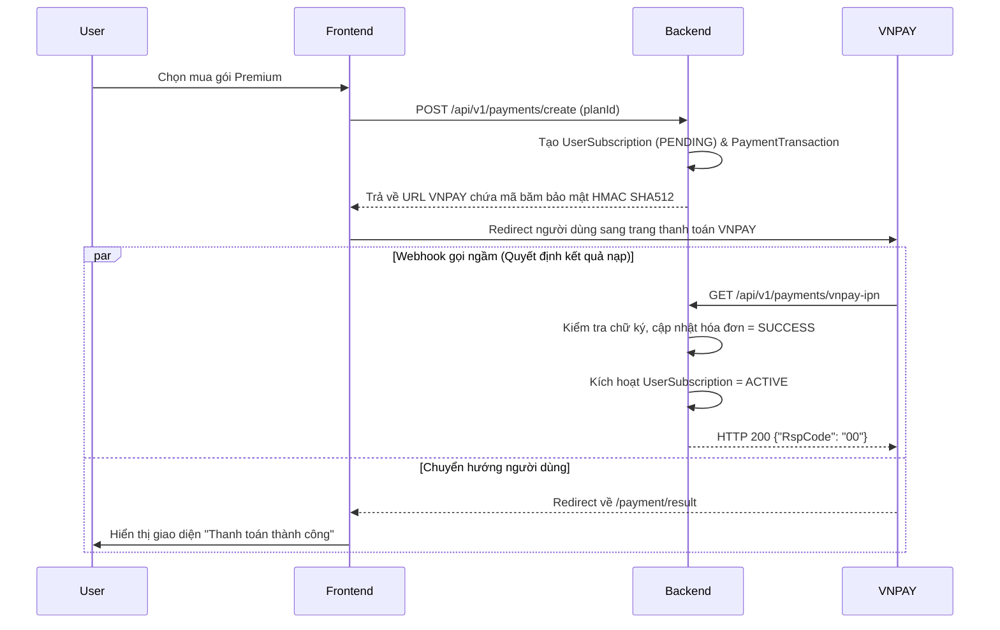

# MODULE 2: HỌC TỪ VỰNG THEO NGỮ CẢNH (Contextual Vocabulary Learning)

## 1. Phân tích yêu cầu (Requirements Analysis)

### 1.1 Tính năng dành cho User (Học viên)
- **Kho chủ đề (Topics Library):** Hệ thống có ít nhất 20 chủ đề thông dụng.
- **Cấu trúc Flashcard:**
  - **Mặt trước:** Từ vựng + Hình ảnh.
  - **Mặt sau:** IPA + Nghĩa tiếng Việt + 2 Câu ví dụ + Nút nghe Audio (US/UK).
  - **Context mở rộng:** Kèm theo 1 đoạn hội thoại (3-5 lượt), 2-3 collocations, và nuance (sắc thái nghĩa).
- **Bộ lọc:** Theo Chủ đề, Trình độ CEFR, Trạng thái (Chưa học, Đang học, Đã học).
- **Gamification (Minigames):** 
  - 4 loại game: Nghe - Chọn từ, Ghép chữ (Scramble), Điền từ (Fill Context), Lật thẻ (Matching Flash).
  - Hệ thống chấm điểm cộng XP, cập nhật streak, thưởng điểm thời gian.
- **Tính năng AI cho Student & Gói cước (Subscriptions):** 
  - Student có thể dùng AI (ví dụ: Chatbot giải thích từ vựng).
  - **Basic Plan:** Giới hạn số lượt dùng AI mỗi ngày (Chặn bằng Redis).
  - **Premium Plan:** Không giới hạn lượt dùng AI. Yêu cầu thanh toán qua **VNPAY**.

### 1.2 Tính năng Admin (AI-Assisted Content Creation)
- Admin nhập nhanh: `Từ vựng`, `Chủ đề`, `Cấp độ CEFR`.
- Trình tạo tự động (Generators): LLM (text), Pollinations.ai (image), Cloud TTS (audio).
- Workflow: Sinh nháp (Draft) -> Admin duyệt -> Publish.

---

## 2. Thực trạng Mã Nguồn Hiện Tại (Dành cho AI lập trình viên kế tiếp)

**⚠️ Quan trọng:** Không cần scan lại project, hãy đọc kỹ phần này.

- **ĐÃ HOÀN THÀNH (100%):**
  - Các Entity phục vụ lưu trữ từ vựng, minigame, tiến trình học đã thiết kế xong.
  - CRUD API cơ bản (`Controller` và `Service`) cho `Topic` và `Vocabulary`.
  - Các Entity mới cho Gói cước: `SubscriptionPlan`, `UserSubscription` cùng file Migration `V3__add_subscription_tables.sql` đã được code.
- **CHƯA HOÀN THÀNH (Cần code thêm):**
  - Cổng thanh toán VNPAY (Entity `PaymentTransaction`, các APIs IPN/Return, Service mã hóa).
  - Luồng gọi Third-party APIs (LLM, TTS, Image) sinh từ vựng.
  - Endpoint nộp điểm minigame (`/minigames/submit`).
  - Logic chặn Rate Limit bằng Redis.

---

## 3. Thiết kế Cơ sở dữ liệu (Database Schema)

### 3.1 BẢNG LƯU TRỮ TỪ VỰNG VÀ HỌC TẬP (Đã có sẵn)
1. **`topics`**: `id`, `name_en`, `name_vi`, `icon_url`, `is_active`.
2. **`vocabulary`**: `id`, `topic_id`, `word`, `cefr_level`, `ipa_transcription`, `definition_vi`, `nuance_note`, `image_url`, `audio_us_url`, `audio_uk_url`, `status`.
   - **(JSONB Columns):** `example_sentences_json`, `collocation_json`, `dialogue_json`.
3. **`student_vocabulary_progress`**: `student_id`, `vocabulary_id`, `status`, `correct_count`, `incorrect_count`.
4. **`minigame_results`**: `game_type`, `score`, `xp_earned`, `duration_seconds`.
5. **`student_stats`**: `student_id`, `total_xp`, `current_streak`, `longest_streak`.

### 3.2 BẢNG GÓI CƯỚC VÀ THANH TOÁN VNPAY (Đã & Chuẩn bị code)
1. **`subscription_plans` (Đã code):**
   - `id`, `name` (BASIC, PREMIUM), `price`, `duration_days`, `ai_prompt_limit` (Null = unlimited).
2. **`user_subscriptions` (Đã code):**
   - `id`, `user_id`, `plan_id`, `start_date`, `end_date`, `status` (ACTIVE, EXPIRED, CANCELLED, PENDING_PAYMENT).
3. **`payment_transactions` (Cần tạo mới cho VNPAY):**
   - `id` (PK)
   - `user_id` (FK -> users)
   - `subscription_id` (FK -> user_subscriptions)
   - `amount` (DECIMAL)
   - `order_info` (VARCHAR): Nội dung hóa đơn.
   - `vnp_txn_ref` (VARCHAR): Mã giao dịch gửi sang VNPAY.
   - `vnp_transaction_no` (VARCHAR): Mã giao dịch VNPAY trả về.
   - `status` (Enum: PENDING, SUCCESS, FAILED)

---

## 4. Kiến trúc Tích hợp (AI, Redis & VNPAY)

### 4.1 Học viên sử dụng AI & Giới hạn qua Redis (Rate Limiter)
- **Cấu trúc Redis Key:** `ai_usage:user:{userId}:date:{YYYY-MM-DD}` (Thời gian hủy TTL: 24 giờ).
- Nếu User dùng gói BASIC -> `INCR` key -> So sánh với `ai_prompt_limit`. Nếu vượt -> Báo lỗi 403. Nếu chưa vượt -> Cho phép gọi LLM.
- Nếu User có gói PREMIUM -> Bỏ qua Redis, cho gọi thẳng.

### 4.2 Luồng Thanh toán VNPAY (Tích hợp Premium)
Sử dụng chuẩn bảo mật 2 luồng phản hồi của VNPAY.

---

## 5. Thiết kế RESTful APIs cần phát triển thêm

### 5.1 Payment & VNPAY APIs (Cần ưu tiên)
- `POST /api/v1/payments/create`: Khởi tạo thanh toán, trả về URL của VNPAY.
- `GET /api/v1/payments/vnpay-return`: URL hứng trình duyệt người dùng trả về (dành cho Frontend xử lý hiển thị).
- `GET /api/v1/payments/vnpay-ipn`: Webhook bắt buộc của VNPAY để cập nhật Data ngầm.

### 5.2 Subscription APIs
- `GET /api/v1/subscriptions/plans`: Hiển thị bảng giá.
- `GET /api/v1/subscriptions/me`: Trạng thái gói hiện tại của User.

### 5.3 Admin AI & Gamification APIs
- `POST /api/v1/admin/vocabularies/generate`: Sinh từ vựng qua AI.
- `POST /api/v1/vocabularies/minigames/submit`: Nộp điểm game, cộng XP.

---

## 6. Lộ trình Triển khai Code (Roadmap tiếp theo)
1. **Giai đoạn 1 (VNPAY):**
   - Code Entity `PaymentTransaction`. Khởi tạo Flyway `V4`.
   - Bổ sung các config VNPAY (`tmn-code`, `hash-secret`) vào `application.yml`.
   - Viết luồng tạo URL và hứng IPN Webhook.
2. **Giai đoạn 2 (Redis):** Cấu hình Rate Limiter đếm lượt AI bằng Redis.
3. **Giai đoạn 3 (AI Admin):** Tích hợp Third-party APIs sinh dữ liệu Flashcard.
4. **Giai đoạn 4 (Gamification):** Viết logic chấm điểm `/minigames/submit`.
