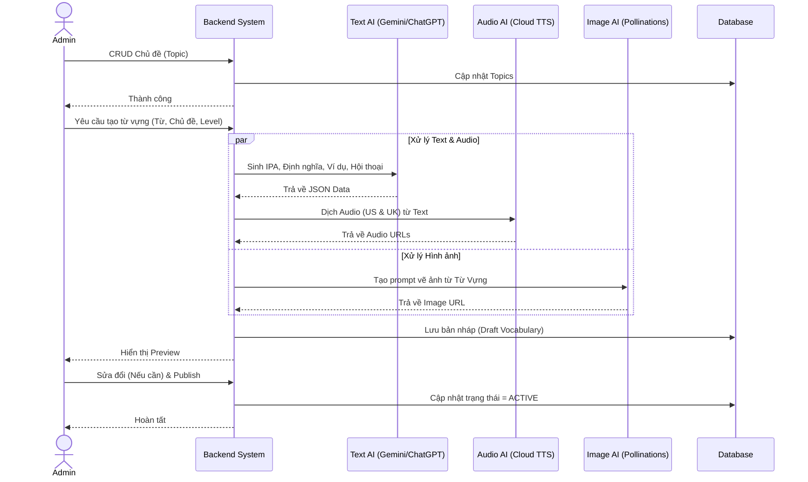
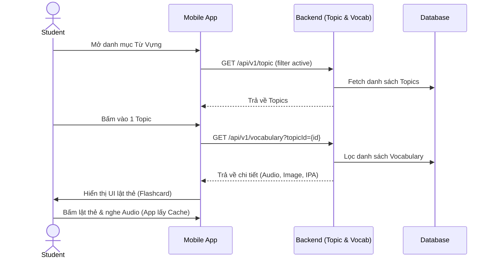
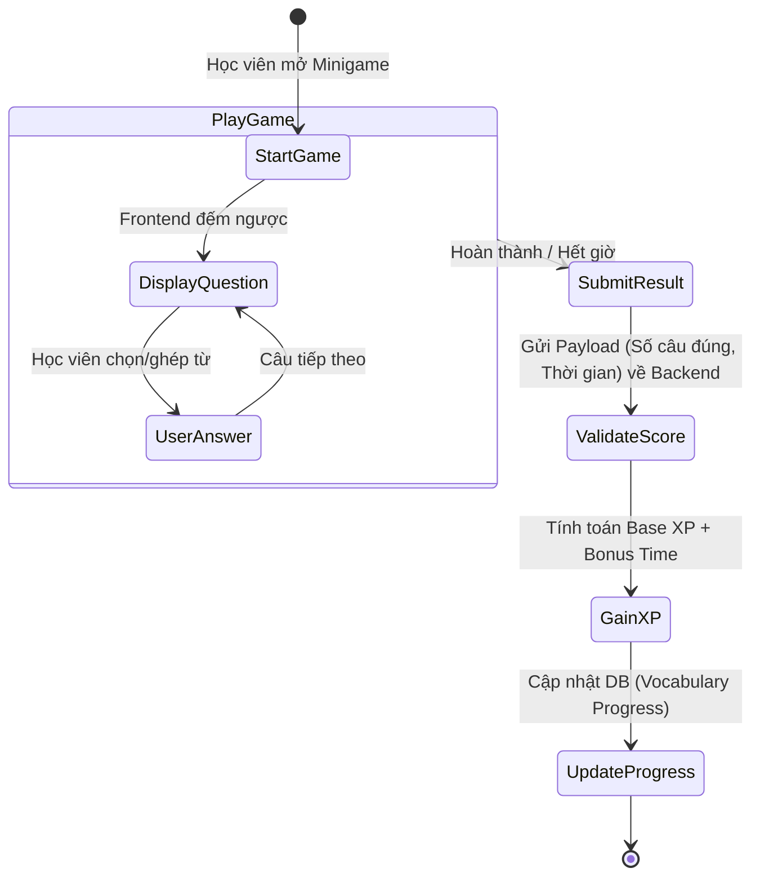
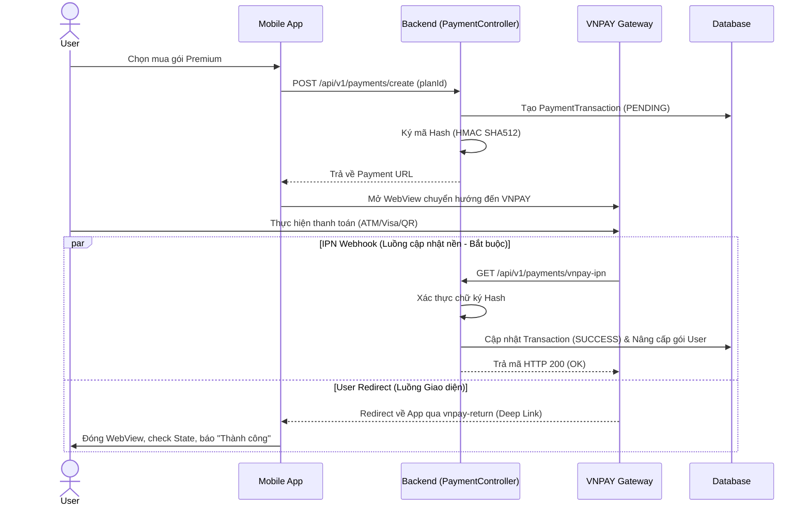

# Kiến trúc Luồng Xử Lý (Flow Architecture) - Module 2

*Tài liệu mô tả ĐẦY ĐỦ các luồng nghiệp vụ chuẩn cho hệ thống Học Từ Vựng, Minigame và Quản lý Gói cước.*

---

## 1. Luồng Quản trị Từ Vựng & AI Content Generation (Admin)
Quy trình Admin cấu hình dữ liệu chủ đề và tự động hóa tạo Flashcard bằng AI.



---

## 2. Luồng Học Tập Flashcard (Student Flow)
Quy trình học viên truy cập vào các chủ đề và luyện tập lật thẻ flashcard.



---

## 3. Luồng Chơi & Chấm điểm Minigame
Vòng đời của mini-game, từ lúc học viên bắt đầu cho đến khi tính điểm tích lũy.



---

## 4. Luồng Thanh Toán VNPAY (Premium Subscription Flow)
Kiến trúc 2 luồng phản hồi bảo mật cho cổng thanh toán bên thứ ba.



---

## 5. Luồng Kiểm soát Rate Limit (Redis API Gateway)
Giới hạn lượt sử dụng AI cho các tài khoản gói Basic.

```mermaid
sequenceDiagram
    actor User
    participant BE as Backend System
    participant Redis as Redis Cache
    participant LLM as Third-party AI

    User->>BE: Yêu cầu tính năng AI (Hỏi chatbot/Sinh câu)
    BE->>BE: Kiểm tra Gói cước (Basic hay Premium)
    
    alt Là tài khoản PREMIUM
        BE->>LLM: Pass - Cho phép gọi AI ngay lập tức
    else Là tài khoản BASIC
        BE->>Redis: INCR key "ai_usage:{userId}:{date}"
        Redis-->>BE: Số lượt hiện tại
        
        alt Lượt < Giới hạn cho phép
            BE->>LLM: Cho phép gọi AI
        else Quá giới hạn
            BE-->>User: HTTP 429 / 403 (QUOTA_EXCEEDED) - Yêu cầu nâng cấp
        end
    end
