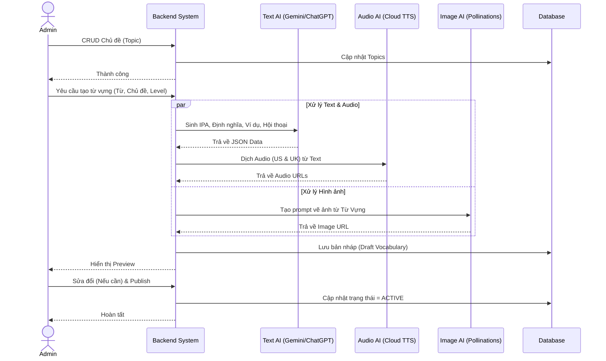
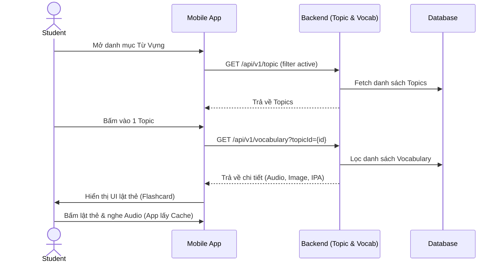
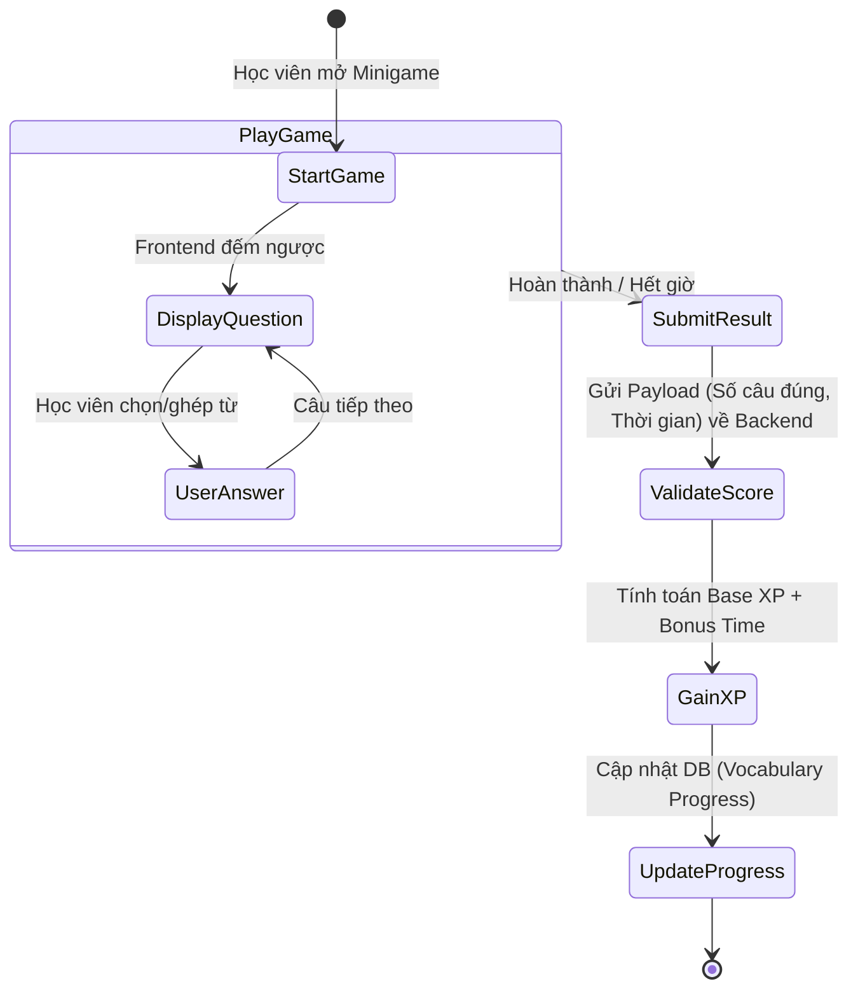
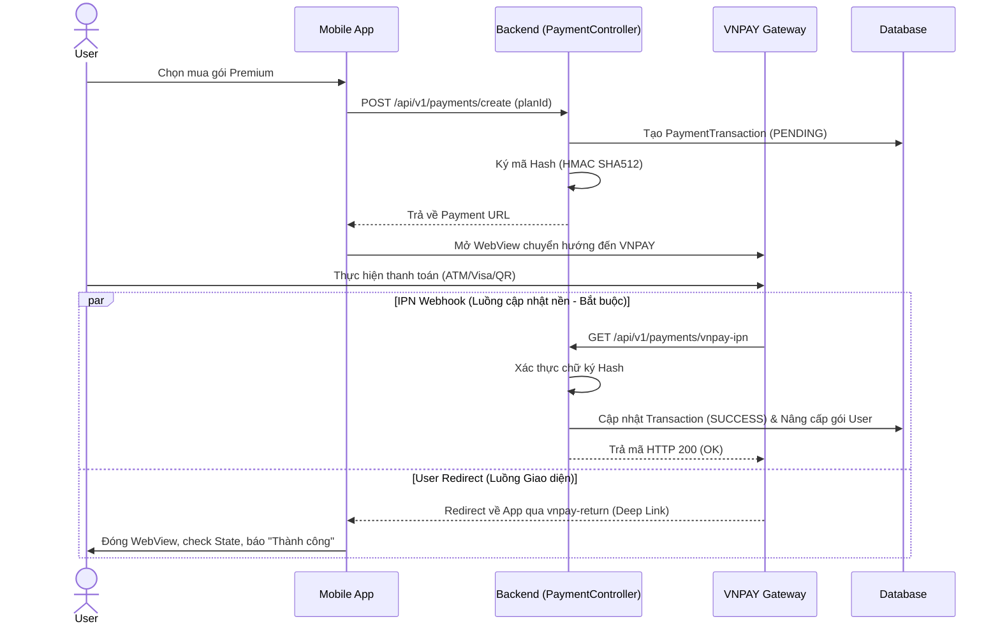

# Kiến trúc Luồng Xử Lý (Flow Architecture) - Module 2

*Tài liệu mô tả ĐẦY ĐỦ các luồng nghiệp vụ chuẩn và Đặc tả API (API Specification) chi tiết nhất cho hệ thống Học Từ Vựng, Minigame và Quản lý Gói cước.*

---

## 1. Luồng Quản trị Từ Vựng & AI Content Generation (Admin)
Quy trình Admin cấu hình dữ liệu chủ đề và tự động hóa tạo Flashcard bằng AI.



### 📦 Đặc tả API tương ứng

#### 1.1 Quản trị Chủ đề (TopicController)
- **`GET /api/v1/topic`**: Lấy danh sách Topic.
  - **Query:** `page`, `size`, `sort`.
  - **Response:** `Page<TopicResponse>` (id, name, description, image_url, status).
- **`POST /api/v1/topic`**: Tạo mới Topic.
  - **Body (JSON/Form-data):** `name`, `description`, `file (Image)`.
- **`PUT /api/v1/topic/{id}`**: Cập nhật Topic.
- **`DELETE /api/v1/topic/{id}`**: Xóa/Ẩn Topic.

#### 1.2 Sinh nội dung AI (AdminVocabularyController)
- **`POST /api/v1/admin/vocabularies/generate`**: Yêu cầu AI sinh nội dung.
  - **Body (JSON):** `{"topicId": 12, "words": ["apple", "banana"], "level": "A1"}`
  - **Response:** `200 OK` (Trả về list vocabulary preview ở trạng thái DRAFT).

---

## 2. Luồng Học Tập Flashcard (Student Flow)
Quy trình học viên truy cập vào các chủ đề và luyện tập lật thẻ flashcard.



### 📦 Đặc tả API tương ứng
- **`GET /api/v1/vocabulary?topicId={id}`** (VocabularyController)
  - **Query Params:** `topicId` (Long), `page` (int), `size` (int).
  - **Response (200 OK):**
    ```json
    {
      "content": [
        {
          "id": 1,
          "word": "Apple",
          "ipa": "/ˈæp.əl/",
          "meaning": "Quả táo",
          "audioUrlUs": "https://cdn.../apple_us.mp3",
          "imageUrl": "https://cdn.../apple.png",
          "examples": ["I eat an apple."]
        }
      ]
    }
    ```

---

## 3. Luồng Chơi & Chấm điểm Minigame
Vòng đời của mini-game, từ lúc học viên bắt đầu cho đến khi tính điểm tích lũy.



### 📦 Đặc tả API tương ứng

#### 3.1 Ghi nhận kết quả Game (MiniGameController / StudentGamificationController)
- **`POST /api/v1/gamification/minigame-results`** (hoặc submit endpoint tương tự)
  - **Request Body:** 
    ```json
    {
      "gameType": "MATCHING_WORDS",
      "topicId": 5,
      "correctAnswers": 10,
      "totalQuestions": 12,
      "timeTakenSeconds": 45
    }
    ```
  - **Response (200 OK):** Trả về số điểm XP đạt được và level hiện tại.

#### 3.2 Lấy thống kê và tiến độ
- **`GET /api/v1/gamification/stat`**: Lấy thông tin thống kê XP, Streak của user.
- **`GET /api/v1/gamification/vocabulary-progress`**: Lấy % hoàn thành các Topic từ vựng.

---

## 4. Luồng Thanh Toán VNPAY (Premium Subscription Flow)
Kiến trúc 2 luồng phản hồi bảo mật cho cổng thanh toán bên thứ ba.



### 📦 Đặc tả API tương ứng
- **`GET /api/v1/subscription-plans`** (SubscriptionPlanController)
  - Lấy danh sách gói cước (Tên, Giá tiền, Các tính năng).
- **`POST /api/v1/payments/create`** (PaymentController)
  - **Request Body:** `{"planId": 2, "returnUrl": "myapp://payment-return"}`
  - **Response:** `{"paymentUrl": "https://sandbox.vnpayment.vn/paymentv2/vpcpay.html?..."}`
- **`GET /api/v1/payments/vnpay-ipn`** (PaymentController)
  - Do Server VNPAY gọi ẩn dưới background. Nhận các tham số `vnp_SecureHash`, `vnp_TxnRef`,... để verify chữ ký và update trạng thái đơn hàng.
