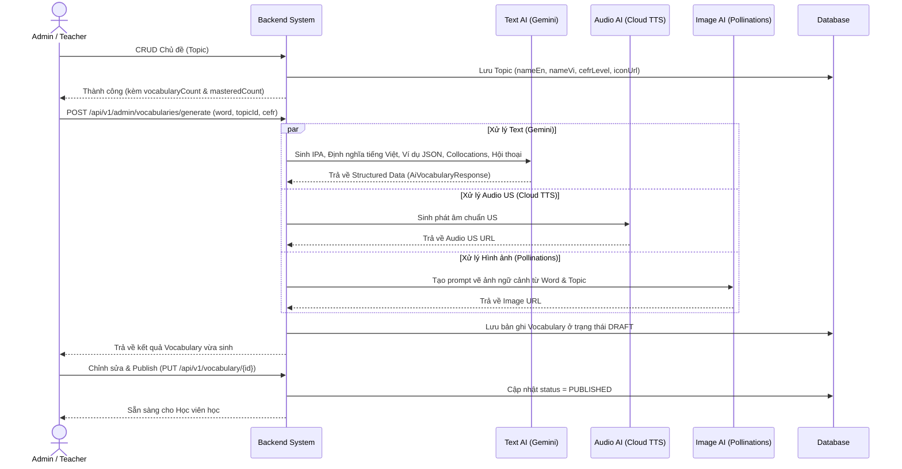
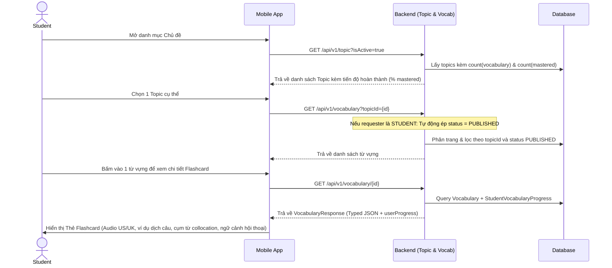
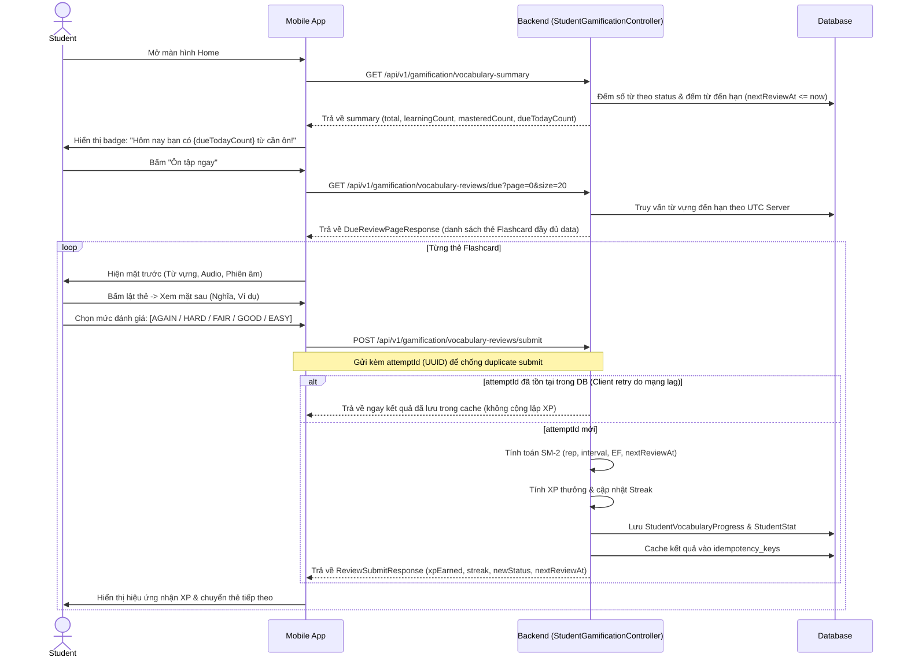
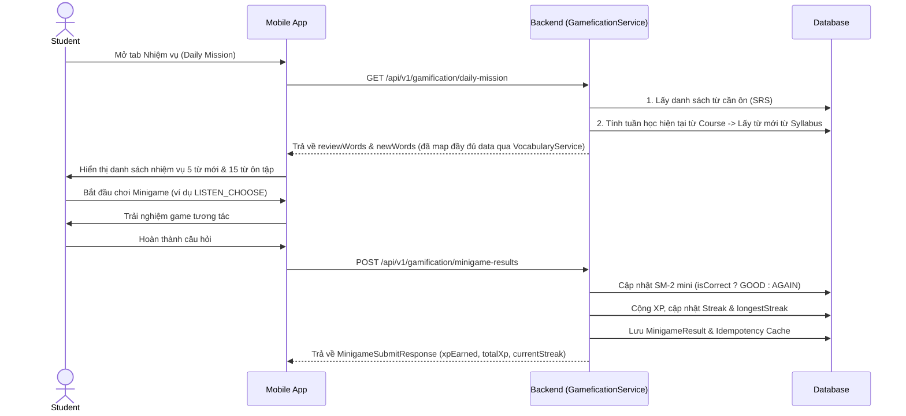
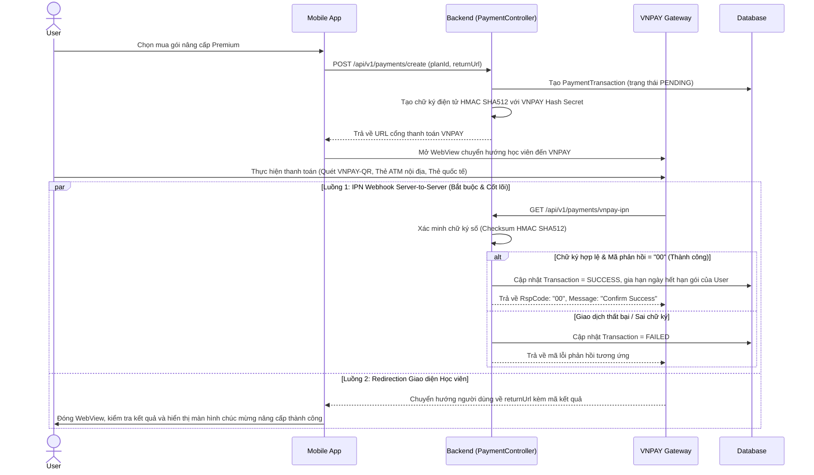

# Kiến trúc Luồng Xử Lý (Flow Architecture) - Module 2

*Tài liệu mô tả ĐẦY ĐỦ các luồng nghiệp vụ chuẩn và Đặc tả API (API Specification) chi tiết nhất cho hệ thống Học Từ Vựng, Thuật toán Lặp lại Ngắt quãng (SRS SM-2), Gamification (Streak, XP, Daily Mission, Minigame), Quản trị Chủ đề và Thanh toán Gói cước (VNPAY).*

---

## 1. Luồng Quản trị Chủ Đề & Sinh Từ Vựng AI (Admin / Teacher Flow)

Quy trình Admin/Teacher cấu hình dữ liệu chủ đề (Topic) và tự động hóa tạo dữ liệu Flashcard đa phương tiện (Định nghĩa, IPA, Ví dụ, Hội thoại, Audio US/UK, Hình ảnh minh họa) thông qua 3 tác vụ AI bất đồng bộ chạy song song.



### 📦 Đặc tả API tương ứng

#### 1.1 Quản trị Chủ đề (`TopicController`)
*Base URL: `/api/v1/topic`*

- **`GET /api/v1/topic`**: Lấy danh sách Topic (phân trang, tìm kiếm).
  - **Query:** `nameSearch` (String - tìm theo tên Anh/Việt), `isActive` (Boolean), `page`, `size`, `sort`.
  - **Response:** `PageResponse<TopicResponse>` (id, nameEn, nameVi, iconUrl, isActive, `vocabularyCount`, `masteredCount` của user hiện tại).
- **`GET /api/v1/topic/{id}`**: Lấy chi tiết một Topic kèm `vocabularyCount` và `masteredCount`.
- **`POST /api/v1/topic`** *(Chỉ ADMIN)*: Tạo chủ đề mới.
  - **Body (JSON):** `{"nameEn": "Travel & Holidays", "nameVi": "Du lịch & Nghỉ dưỡng", "iconUrl": "https://...", "isActive": true}`
- **`PUT /api/v1/topic/{id}`** *(Chỉ ADMIN)*: Cập nhật chủ đề.
- **`DELETE /api/v1/topic/{id}`** *(Chỉ ADMIN)*: Xóa chủ đề.
- **`PATCH /api/v1/topic/activate/{id}`** & **`PATCH /api/v1/topic/deactivate/{id}`** *(Chỉ ADMIN)*: Kích hoạt / Hủy kích hoạt chủ đề.

#### 1.2 Sinh nội dung AI (`AdminVocabularyController`)
*Base URL: `/api/v1/admin/vocabularies`*

- **`POST /api/v1/admin/vocabularies/generate`** *(Chỉ ADMIN)*:
  - Chạy song song 3 CompletableFuture: Text Generation + TTS Audio + Image Generation.
  - **Query Params:** `word` (String), `topicId` (Short), `cefr` (String: `A1`, `A2`, `B1`, `B2`, `C1`, `C2`).
  - **Response:** Bản ghi `Vocabulary` hoàn chỉnh lưu ở trạng thái `DRAFT`.

#### 1.3 Quản trị Từ vựng CRUD (`VocabularyController`)
*Base URL: `/api/v1/vocabulary`*

- **`POST /api/v1/vocabulary`** *(ADMIN / TEACHER)*: Tạo từ vựng thủ công.
- **`PUT /api/v1/vocabulary/{id}`** *(ADMIN / TEACHER)*: Sửa từ vựng, đổi trạng thái sang `PUBLISHED`.
- **`DELETE /api/v1/vocabulary/{id}`** *(ADMIN / TEACHER)*: Xóa từ vựng.

---

## 2. Luồng Học Tập & Tra Cứu Từ Vựng (Student Flow)

Quy trình học viên duyệt theo chủ đề, tra cứu từ vựng và xem chi tiết thẻ Flashcard với cấu trúc JSON đã được phân tích dạng đối tượng (typed objects) kèm tiến trình học cá nhân.



### 📦 Đặc tả API tương ứng

#### 2.1 Tra cứu danh sách từ vựng (`VocabularyController`)
- **`GET /api/v1/vocabulary`**:
  - **Query Params:**
    - `topicId` (Short, optional): Lọc theo chủ đề.
    - `createdById` (Long, optional): Lọc theo người tạo.
    - `status` (VocabularyStatus, optional): *Lưu ý: Với học viên (`ROLE_STUDENT`), hệ thống tự động ép buộc `status = PUBLISHED` để đảm bảo bảo mật nội dung nháp.*
    - `cefrLevel` (CefrLevel, optional): `A1`, `A2`, `B1`, `B2`, `C1`, `C2`.
    - `wordSearch` (String, optional): Tìm kiếm theo từ tiếng Anh.
    - `page`, `size`, `sort`.
  - **Response (200 OK):** `PageResponse<VocabularyResponse>`

#### 2.2 Chi tiết từ vựng với Typed JSON & Progress
- **`GET /api/v1/vocabulary/{id}`**:
  - **Response (200 OK):**
    ```json
    {
      "success": true,
      "code": 1000,
      "data": {
        "id": 101,
        "topic": {
          "id": 1,
          "nameEn": "Travel",
          "nameVi": "Du lịch"
        },
        "word": "Itinerary",
        "ipaTranscription": "/aɪˈtɪn.ər.ər.i/",
        "cefrLevel": "B1",
        "definitionVi": "Lịch trình, lộ trình chuyến đi",
        "imageUrl": "https://cdn.../itinerary.jpg",
        "audioUsUrl": "https://cdn.../itinerary_us.mp3",
        "audioUkUrl": "https://cdn.../itinerary_uk.mp3",
        "nuanceNote": "Dùng cho cả chuyến đi công tác lẫn du lịch nghỉ dưỡng.",
        "exampleSentences": [
          {
            "sentence": "We planned a detailed itinerary for our trip to Japan.",
            "translationVi": "Chúng tôi đã lên một lịch trình chi tiết cho chuyến đi Nhật Bản."
          }
        ],
        "collocations": [
          {
            "phrase": "travel itinerary",
            "meaningVi": "lịch trình chuyến du lịch"
          }
        ],
        "dialogue": [
          {
            "speaker": "A",
            "sentence": "Have you finalized our vacation itinerary yet?",
            "translationVi": "Cậu đã chốt lịch trình kỳ nghỉ của chúng mình chưa?"
          },
          {
            "speaker": "B",
            "sentence": "Yes, I will send you the itinerary tonight.",
            "translationVi": "Rồi, tối nay mình sẽ gửi lịch trình cho cậu."
          }
        ],
        "status": "PUBLISHED",
        "userProgress": {
          "status": "LEARNING",
          "lastReviewedAt": "2026-09-08T14:30:00",
          "nextReviewAt": "2026-09-11T14:30:00"
        }
      }
    }
    ```

---

## 3. Luồng Ôn Tập Flashcard Theo Thuật Toán Lặp Lại Ngắt Quãng (SRS SM-2) & Idempotency

Đây là tính năng cốt lõi giúp học viên ghi nhớ từ vựng lâu dài theo đường cong quên lãng Ebbinghaus bằng thuật toán **SuperMemo-2 (SM-2)**, kết hợp cơ chế **Idempotency Key** bảo vệ chống duplicate khi thiết bị mất kết nối hoặc retry.

### 🧠 Nguyên lý Thuật toán SM-2 & Đánh giá Flashcard:
* **Thang điểm tự đánh giá (ReviewRating)**:
  - `AGAIN` (Quality = 0): Hoàn toàn không nhớ $\rightarrow$ Reset chu kỳ ôn tập về ngày đầu ($rep = 0, interval = 1$), status giữ hoặc chuyển về `LEARNING`.
  - `HARD` (Quality = 1): Sai nhưng nhìn đáp án thấy quen $\rightarrow$ Reset chu kỳ ($rep = 0, interval = 1$).
  - `FAIR` (Quality = 3): Nhớ ra nhưng mất thời gian đáng kể $\rightarrow$ Tính là nhớ đúng, tiếp tục tăng interval.
  - `GOOD` (Quality = 4): Nhớ tốt sau một chút do dự $\rightarrow$ Tăng interval bình thường.
  - `EASY` (Quality = 5): Phản xạ tức thì $\rightarrow$ Interval và Easiness Factor (EF) tăng mạnh nhất.
* **Công thức điều chỉnh khoảng cách (Interval)**:
  - Lần 1 ($rep = 0$): $I(1) = 1$ ngày.
  - Lần 2 ($rep = 1$): $I(2) = 6$ ngày.
  - Lần 3 trở đi ($rep \ge 2$): $I(n) = \text{round}(I(n - 1) \times EF)$.
* **Cập nhật Easiness Factor**:
  - $EF' = EF + (0.1 - (5 - q) \times (0.08 + (5 - q) \times 0.02))$, với cận dưới $EF \ge 1.3$.
* **Chuyển đổi trạng thái học (LearningStatus)**:
  - $rep \ge 3$ và $quality \ge 4 \rightarrow \text{MASTERED}$ (Đã thuộc lòng).
  - $rep \ge 1 \rightarrow \text{REVIEWING}$ (Đang trong chu kỳ ôn tập).
  - $quality = 0 \rightarrow \text{LEARNING}$ (Cần học lại).



### 📦 Đặc tả API tương ứng

#### 3.1 Tóm tắt từ vựng cho Home (`GET /api/v1/gamification/vocabulary-summary`)
- Trả về tổng quan số lượng từ theo từng nhóm trạng thái và số từ đến hạn ôn hôm nay trong 1 lượt query tối ưu.
- **Response (200 OK):**
  ```json
  {
    "success": true,
    "code": 1000,
    "data": {
      "total": 120,
      "newCount": 30,
      "learningCount": 50,
      "reviewingCount": 25,
      "masteredCount": 15,
      "dueTodayCount": 8
    }
  }
  ```

#### 3.2 Hàng đợi ôn tập Flashcard SRS (`GET /api/v1/gamification/vocabulary-reviews/due`)
- Backend tự tính toán danh sách từ đến hạn dựa trên `nextReviewAt <= now()` của server. Mobile không cần tự suy luận logic ngày đến hạn.
- **Query Params:** `page` (int, default 0), `size` (int, default 20), `topicId` (Short, optional), `cefrLevel` (CefrLevel, optional).
- **Response (200 OK):**
  ```json
  {
    "success": true,
    "code": 1000,
    "data": {
      "dueCount": 8,
      "items": [
        {
          "progressId": 45,
          "status": "REVIEWING",
          "nextReviewAt": "2026-09-09T08:00:00",
          "vocabularyId": 101,
          "word": "Itinerary",
          "ipaTranscription": "/aɪˈtɪn.ər.ər.i/",
          "definitionVi": "Lịch trình chuyến đi",
          "imageUrl": "https://cdn.../itinerary.jpg",
          "audioUsUrl": "https://cdn.../itinerary_us.mp3",
          "audioUkUrl": "https://cdn.../itinerary_uk.mp3",
          "cefrLevel": "B1",
          "topicId": 1,
          "topicNameEn": "Travel"
        }
      ],
      "page": 0,
      "size": 20,
      "totalElements": 8,
      "totalPages": 1
    }
  }
  ```

#### 3.3 Gửi kết quả đánh giá Flashcard (`POST /api/v1/gamification/vocabulary-reviews/submit`)
- **Request Body (JSON):**
  ```json
  {
    "vocabularyId": 101,
    "rating": "GOOD",
    "durationSeconds": 5,
    "attemptId": "c8b3a1a0-4f5a-4b9b-8d1e-2c3f4e5a6b7c"
  }
  ```
  *(Lưu ý: `attemptId` là UUID 36 ký tự do client sinh. Gửi lại cùng `attemptId` sẽ nhận lại kết quả cũ mà không bị lặp XP).*
- **Response (200 OK):**
  ```json
  {
    "success": true,
    "code": 1000,
    "data": {
      "vocabularyId": 101,
      "previousStatus": "LEARNING",
      "newStatus": "REVIEWING",
      "nextReviewAt": "2026-09-13T10:30:00",
      "intervalDays": 3,
      "xpEarned": 5,
      "totalXp": 320,
      "currentStreak": 6
    }
  }
  ```

#### 3.4 Xem tiến trình học từ vựng (`GET /api/v1/gamification/vocabulary-progress`)
- **Query Params:**
  - `status` (LearningStatus, optional): `NEW`, `LEARNING`, `REVIEWING`, `MASTERED`.
  - `dueOnly` (Boolean, default false): Chỉ lấy từ đang đến hạn ôn.
  - `page`, `size`, `sortBy` (default `lastPracticedAt`), `direction` (`asc`/`desc`).
- **Endpoint xem chi tiết 1 từ:** `GET /api/v1/gamification/vocabulary-progress/{id}`.

---

## 4. Luồng Nhiệm Vụ Hàng Ngày (Daily Mission) & Minigame Gamification

Hệ thống gamification thúc đẩy thói quen học tập mỗi ngày qua Daily Mission và các minigame tương tác.



### 🎮 Các dạng Minigame (`GameType`):
- `LISTEN_CHOOSE`: Nghe phát âm và chọn nghĩa đúng (Base XP: 10).
- `WORD_SCRAMBLE`: Sắp xếp lại các ký tự bị xáo trộn để tạo thành từ (Base XP: 15).
- `FILL_CONTEXT`: Điền từ vựng thích hợp vào ngữ cảnh câu bị khuyết (Base XP: 20).
- `MATCHING_FLASH`: Nối nhanh các cặp thẻ từ và nghĩa tiếng Việt (Base XP: 10).
- *Bonus thời gian*: Trả lời trong vòng $\le 3$ giây được thưởng thêm +5 XP.

### 📦 Đặc tả API tương ứng

#### 4.1 Nhiệm vụ hàng ngày (`GET /api/v1/gamification/daily-mission`)
- Tự động phân bổ:
  - `reviewWords`: Danh sách từ đến hạn ôn tập theo SRS.
  - `newWords`: Danh sách từ mới ngẫu nhiên lấy từ Topic tương ứng với tuần học trong giáo trình (Syllabus) của các khóa học mà học viên đang kích hoạt.
- **Response (200 OK):** `DailyMissionResponse` (`reviewWords`, `newWords`).

#### 4.2 Nộp kết quả Minigame (`POST /api/v1/gamification/minigame-results`)
- **Request Body (JSON):**
  ```json
  {
    "vocabularyId": 101,
    "gameType": "LISTEN_CHOOSE",
    "isCorrect": true,
    "durationSeconds": 3,
    "attemptId": "e1f2a3b4-5c6d-7e8f-9a0b-1c2d3e4f5a6b"
  }
  ```
- **Response (200 OK):**
  ```json
  {
    "success": true,
    "code": 1000,
    "data": {
      "xpEarned": 15,
      "totalXp": 335,
      "currentStreak": 6,
      "newVocabularyStatus": "LEARNING",
      "resultId": 1250
    }
  }
  ```

#### 4.3 Xem lịch sử Minigame & Thống kê cá nhân
- **`GET /api/v1/gamification/minigame-results`**: Danh sách lịch sử chơi minigame (phân trang).
- **`GET /api/v1/gamification/minigame-results/{id}`**: Chi tiết kết quả một lượt chơi.
- **`GET /api/v1/gamification/stat`**: Lấy thông số học tập cá nhân (`totalXp`, `currentStreak`, `longestStreak`, `streakFreezeCount`, `lastActivityDate`, `totalStudyMinutes`).

---

## 5. Luồng Thanh Toán VNPAY (Premium Subscription Flow)

Kiến trúc bảo mật hai luồng độc lập: Webhook IPN (Server-to-Server) để xác thực giao dịch tài chính an toàn và Return URL (Client Redirection) để cập nhật trải nghiệm người dùng ngay lập tức.



### 📦 Đặc tả API tương ứng

- **`GET /api/v1/subscription-plans`** (`SubscriptionPlanController`):
  - Lấy danh sách gói cước (Tên gói, thời hạn, giá niêm yết, tính năng nổi bật).
- **`POST /api/v1/payments/create`** (`PaymentController`):
  - **Request Body:**
    ```json
    {
      "planId": 2,
      "returnUrl": "myapp://payment-return"
    }
    ```
  - **Response (200 OK):**
    ```json
    {
      "success": true,
      "code": 1000,
      "data": {
        "paymentUrl": "https://sandbox.vnpayment.vn/paymentv2/vpcpay.html?vnp_Amount=19900000&vnp_Command=pay&..."
      }
    }
    ```
- **`GET /api/v1/payments/vnpay-ipn`** (`PaymentController`):
  - Webhook nhận callback ngầm từ máy chủ VNPAY để kiểm tra tính toàn vẹn dữ liệu, xác minh chữ ký hash HMAC SHA512 và kích hoạt quyền lợi gói cước Premium cho học viên.
- **`GET /api/v1/payments/vnpay-return`** (`PaymentController`):
  - URL tiếp nhận điều hướng sau khi khách hàng thanh toán xong trên cổng VNPAY.
