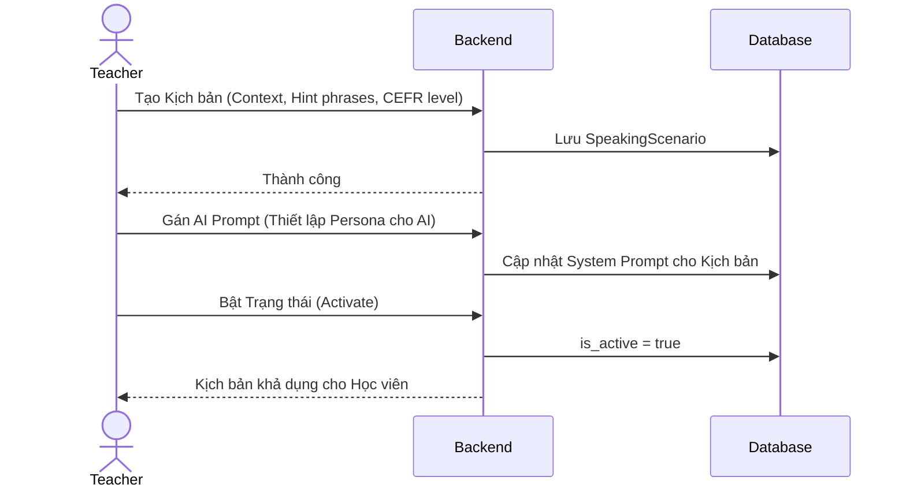
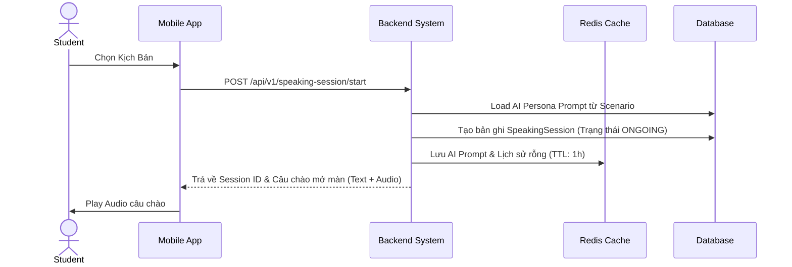
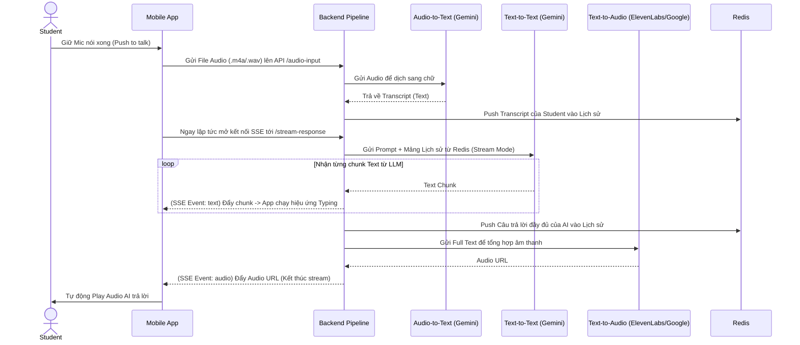
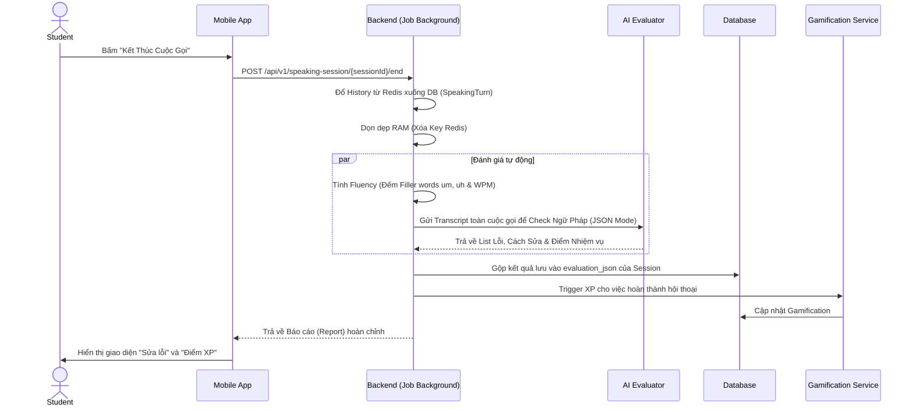

# Kiến trúc Luồng Xử Lý (Flow Architecture) - Module 3

*Tài liệu mô tả ĐẦY ĐỦ các luồng nghiệp vụ chuẩn và Đặc tả API (API Specification) chi tiết nhất cho hệ thống AI Speaking Coach (Phản xạ giao tiếp).*

---

## 1. Luồng Quản trị Kịch Bản (Admin/Teacher Flow)
Giáo viên hoặc Admin cấu hình các Scenario để luyện tập.



### 📦 Đặc tả API tương ứng (SpeakingScenarioController)
- **`GET /api/v1/speaking-scenarios`**: Lấy danh sách Kịch bản. (Hỗ trợ phân trang, filter theo role học viên/giáo viên).
- **`POST /api/v1/speaking-scenarios`**: Tạo mới Kịch bản (Context, Hint phrases, CEFR level, System Prompt, Persona).
- **`PUT /api/v1/speaking-scenarios/{id}`**: Cập nhật kịch bản (Bao gồm việc Activate/Deactivate kịch bản để public cho học viên).
- **`DELETE /api/v1/speaking-scenarios/{id}`**: Xóa kịch bản.

---

## 2. Luồng Khởi tạo Phiên Giao Tiếp (Session Initialization)
Thiết lập ngữ cảnh và chuẩn bị bộ nhớ cache cực nhanh để phục vụ hội thoại không độ trễ.



### 📦 Đặc tả API tương ứng (SpeakingSessionController)
- **`POST /api/v1/speaking-session/start`**:
  - **Request Body:** `{"scenarioId": 15}`
  - **Response (200 OK):**
    ```json
    {
      "sessionId": "a1b2c3d4-...",
      "initialGreeting": "Hello! Welcome to the coffee shop. What can I get for you today?",
      "audioUrl": "https://cdn.../greeting.mp3"
    }
    ```

---

## 3. Đường ống Streaming Thời gian thực (Real-time Pipeline)
Đây là cốt lõi của Module 3, xử lý luồng Voice-to-Voice thông qua STT -> LLM -> TTS trả về dạng Stream SSE.



### 📦 Đặc tả API tương ứng (SpeakingSessionController)
- **`POST /api/v1/speaking-session/{id}/audio-input`**:
  - **Content-Type:** `multipart/form-data`
  - **Body:** `file` (File audio người dùng vừa thu âm).
  - **Response:** `202 Accepted` (Báo hiệu backend đã nhận file và bắt đầu xử lý STT).
- **`GET /api/v1/speaking-session/{id}/stream-response`**:
  - **Content-Type:** `text/event-stream` (Server-Sent Events)
  - **Event Stream:** Trả về liên tục các chunk chữ từ LLM (`event: text`) và URL file audio hoàn chỉnh ở cuối luồng (`event: audio`).

---

## 4. Luồng Phân tích & Đánh giá Hậu kỳ (Post-Conversation Evaluation)
Xử lý nền (Background job) chạy sau khi user kết thúc cuộc gọi để chấm lỗi ngữ pháp, trôi chảy và XP.



### 📦 Đặc tả API tương ứng (SpeakingSessionController)
- **`POST /api/v1/speaking-session/{id}/end`**:
  - **Response (200 OK):** Trả về JSON chứa Report toàn bộ cuộc gọi (bao gồm transcript, điểm phát âm, danh sách lỗi ngữ pháp và đề xuất cải thiện).
