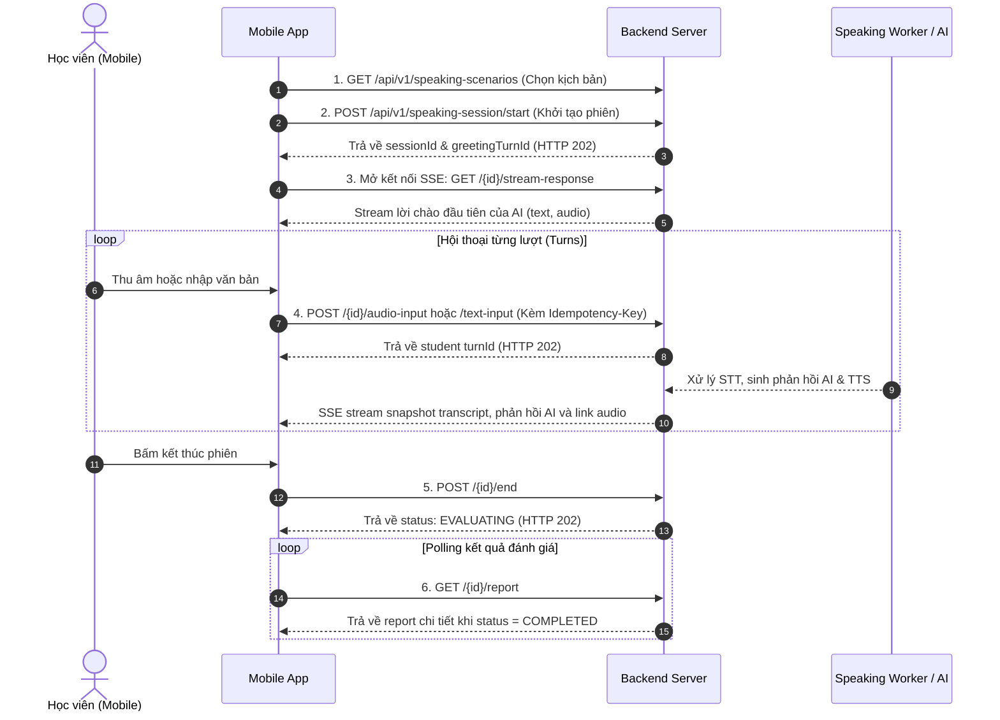

# Module 3: Speaking – Hướng Dẫn Tích Hợp Mobile

Tài liệu này cung cấp hướng dẫn chi tiết dành cho lập trình viên Mobile (iOS / Android / Flutter / React Native) để tích hợp tính năng luyện nói (Speaking Session) tương tác với AI theo thời gian thực.

---

## 📌 Quy Định Chung

- **Base Path:** `/api/v1`
- **Authentication:** Tất cả request (ngoại trừ các endpoint public) bắt buộc phải kèm header:
  ```http
  Authorization: Bearer <access-token>
  ```
- **Xử lý Session không hợp lệ:** Session không tồn tại hoặc không thuộc quyền sở hữu của user đăng nhập sẽ trả về `404 Not Found`.
- **Định danh lượt nói:** Luôn dùng `turn.id` làm khóa định danh duy nhất. Trường `turnIndex` chỉ phục vụ việc sắp xếp thứ tự hiển thị trên UI.

---

## 🔄 Tổng Quan Luồng Nghiệp Vụ (Lifecycle)



---

## 1. Lấy danh sách Scenario (Kịch bản luyện nói)

Trước khi bắt đầu, người dùng chọn một kịch bản luyện nói phù hợp với trình độ.

### Request
```http
GET /api/v1/speaking-scenarios?cefrLevel=B1&isActive=true
```

### Query Parameters
| Tham số | Kiểu | Bắt buộc | Mô tả |
| :--- | :--- | :--- | :--- |
| `cefrLevel` | `String` | Không | Lọc theo cấp độ CEFR (`A1`, `A2`, `B1`, `B2`, `C1`, `C2`) |
| `isActive` | `Boolean`| Có | Luôn truyền `true` đối với học viên |

> [!WARNING]
> Học viên chỉ được phép xem các kịch bản đang hoạt động (`isActive=true`). Không bao giờ hiển thị các trường `aiSystemPrompt` và `hintPhrases` trên giao diện học viên.

---

## 2. Bắt đầu phiên luyện nói

Khởi tạo phiên luyện nói mới dựa trên `scenarioId` đã chọn.

### Request
```http
POST /api/v1/speaking-session/start
Content-Type: application/json

{
  "scenarioId": 12
}
```

### Response (HTTP 202 Accepted)
```json
{
  "success": true,
  "data": {
    "id": 2,
    "status": "ONGOING",
    "scenarioId": 12,
    "greetingTurnId": 2,
    "hintUsedCount": 0,
    "turns": [
      {
        "id": 2,
        "turnIndex": 1,
        "speaker": "AI",
        "status": "PENDING",
        "audioStatus": "PENDING",
        "transcriptText": ""
      }
    ]
  }
}
```

> [!IMPORTANT]
> - Lưu lại `sessionId = data.id` và `greetingTurnId` để sử dụng xuyên suốt phiên.
> - Lời chào của AI được tạo ở chế độ bất đồng bộ. Mobile cần mở ngay kết nối SSE ở bước 3 để nhận nội dung và âm thanh lời chào.

---

## 3. Lắng nghe phản hồi từ AI qua SSE (Server-Sent Events)

Kết nối stream sự kiện để nhận cập nhật văn bản và âm thanh thời gian thực từ AI.

### Request
```http
GET /api/v1/speaking-session/{sessionId}/stream-response
Accept: text/event-stream
```

### Các loại sự kiện SSE (Events)

#### 1. Sự kiện cập nhật lời thoại AI (`event: text`)
Bắn ra khi AI đang sinh hoặc hoàn thành nội dung phản hồi.
```text
event: text
data: {
  "id": 2,
  "turnIndex": 1,
  "speaker": "AI",
  "status": "COMPLETED",
  "transcriptText": "Hello! I'm Aurora. How are you doing today?",
  "audioStatus": "PENDING"
}
```

#### 2. Sự kiện cập nhật phiên âm của học viên (`event: transcript`)
Bắn ra khi backend hoàn tất nhận diện giọng nói (STT) từ file ghi âm của học viên.
```text
event: transcript
data: {
  "id": 3,
  "turnIndex": 2,
  "speaker": "STUDENT",
  "status": "COMPLETED",
  "transcriptText": "I am doing well, thank you."
}
```

#### 3. Sự kiện âm thanh sẵn sàng (`event: audio`)
Bắn ra khi file âm thanh TTS của AI đã được tạo và sẵn sàng để phát.
```text
event: audio
data: {
  "turnId": 2,
  "audioUrl": "https://res.cloudinary.com/.../speech.mp3"
}
```

#### 4. Sự kiện hoàn tất lượt AI (`event: done`)
```text
event: done
data: {
  "sessionId": 2
}
```

#### 5. Sự kiện lỗi (`event: error`)
```text
event: error
data: {
  "sessionId": 2
}
```

> [!TIP]
> **Quy tắc xử lý SSE trên Mobile:**
> 1. **Dữ liệu dạng Snapshot:** Mỗi event `text` / `transcript` chứa toàn bộ snapshot mới nhất của lượt nói. Mobile cần **thay thế (upsert)** theo `turn.id`, không nối chuỗi (append) vào bản cũ.
> 2. **Chống phát trùng (Deduplication):** Lưu trữ danh sách `playedTurnAudioIds` trên app để đảm bảo mỗi `turnId` chỉ tự động phát âm thanh một lần duy nhất.
> 3. **Reconnect tự động:** SSE là kết nối đọc dữ liệu thuần túy (read-only snapshot). Khi mất mạng hoặc reconnect, không gọi lại API tạo AI mới mà chỉ cần kết nối lại SSE để nhận snapshot hiện tại từ database.
> 4. **Xử lý lỗi:** Khi nhận `event: error`, đọc trường `errorCode` từ turn snapshot để hiển thị thông báo thích hợp.

---

## 4. Gửi phản hồi của học viên (Audio & Text Input)

Mỗi lần gửi lượt nói, Mobile **bắt buộc** phải cung cấp header `Idempotency-Key` để tránh gửi trùng lặp dữ liệu khi mạng chập chờn.

> [!NOTE]
> - **Idempotency-Key:** Chuỗi ngẫu nhiên có độ dài từ **8 đến 100 ký tự** (chỉ gồm `A-Z`, `a-z`, `0-9`, `_`, `-`).
> - Nếu thử lại (retry) cùng một thao tác/file: **giữ nguyên key cũ**.
> - Server sẽ từ chối với lỗi `409 Conflict` nếu cùng một key nhưng payload nội dung bị thay đổi.

### A. Gửi dữ liệu âm thanh (Voice Input)
Hỗ trợ các định dạng: `.wav`, `.webm`, `.ogg`, `.m4a`, `.mp3` (Dung lượng tối đa **5 MiB**).

```http
POST /api/v1/speaking-session/{sessionId}/audio-input
Authorization: Bearer <access-token>
Idempotency-Key: input-01HZX7M4Q8K2A1B2C3D4E5F6
Content-Type: multipart/form-data

file: [binary_audio_data]
```

### B. Gửi dạng văn bản (Text Input)
Áp dụng khi học viên gõ phím trực tiếp (Tối đa **4.000 ký tự**).

```http
POST /api/v1/speaking-session/{sessionId}/text-input
Authorization: Bearer <access-token>
Idempotency-Key: input-01HZX7M4Q8K2A1B2C3D4E5F6
Content-Type: application/json

{
  "transcript": "From my perspective, our team prioritizes quick delivery."
}
```

### Response chung (HTTP 202 Accepted)
```json
{
  "success": true,
  "data": {
    "turnId": 3,
    "status": "PENDING",
    "transcript": ""
  }
}
```
Sau khi nhận mã `202`, Mobile chuyển trạng thái lượt nói sang `PENDING` và tiếp tục theo dõi SSE để nhận kết quả nhận diện giọng nói và phản hồi tiếp theo từ AI.

---

## 5. Sử dụng gợi ý (Hints)

Khi học viên gặp khó khăn trong việc diễn đạt, có thể bấm nút lấy gợi ý câu thoại.

### Request
```http
POST /api/v1/speaking-session/{sessionId}/hints
Authorization: Bearer <access-token>
Idempotency-Key: hint-01HZX7M4Q8K2A1B2C3D4E5F6
```

### Response (HTTP 200 OK)
```json
{
  "success": true,
  "data": {
    "phrases": [
      "Could you clarify the delivery timeline?",
      "From my perspective, we should focus on quality first."
    ]
  }
}
```

> [!NOTE]
> Gửi cùng một `Idempotency-Key` sẽ trả về danh sách gợi ý cũ mà **không làm tăng** số lần dùng gợi ý (`hintUsedCount`). Mobile cần hiển thị số lượng theo giá trị server trả về.

---

## 6. Kết thúc phiên & Lấy báo cáo đánh giá

### Bước 1: Gọi kết thúc phiên
```http
POST /api/v1/speaking-session/{sessionId}/end
Authorization: Bearer <access-token>
```
- Nếu phiên chưa có lượt nói nào của học viên: Server trả về `409 Conflict`.
- Nếu phiên đang trong quá trình đánh giá: Server trả về `HTTP 202 Accepted` với `status: "EVALUATING"`.
- Nếu phiên đã hoàn tất đánh giá trước đó: Server trả về `HTTP 200 OK` với `status: "COMPLETED"`.

### Bước 2: Polling báo cáo đánh giá
Mobile thực hiện polling định kỳ (ví dụ mỗi 2–3 giây) cho đến khi `status` chuyển sang `COMPLETED` hoặc `EVALUATION_FAILED`.

```http
GET /api/v1/speaking-session/{sessionId}/report
Authorization: Bearer <access-token>
```

---

## 7. Cấu trúc nhận xét và chấm điểm chi tiết

Trong kết quả trả về của API `/report`, dữ liệu đánh giá được chia làm 2 cấp độ:

### A. Nhận xét theo từng lượt nói của học viên (SpeakingTurnResponse)
```json
{
  "id": 3,
  "turnIndex": 2,
  "speaker": "STUDENT",
  "status": "COMPLETED",
  "evaluationStatus": "COMPLETED",
  "transcriptText": "I go to the store yesterday and buy a very big problem.",
  "grammarErrors": [
    {
      "original": "I go",
      "correction": "I went",
      "explanation": "Use past simple tense for actions completed in the past."
    }
  ],
  "vocabularySuggestions": [
    {
      "original": "very big problem",
      "suggestion": "major issue",
      "reason": "Sounds more professional in a business context."
    }
  ]
}
```
- Nếu không có lỗi ngữ pháp hoặc gợi ý từ vựng, server trả về mảng rỗng `[]`.

### B. Báo cáo tổng thể toàn phiên (evaluation)
```json
{
  "status": "COMPLETED",
  "taskCompletionScore": 85,
  "fluencyScore": null,
  "intonationScore": null,
  "xpEarned": 50,
  "hintUsedCount": 1,
  "evaluation": {
    "general_feedback": "You communicated clearly and addressed all main objectives effectively.",
    "criteria": [
      {
        "goal_index": 1,
        "achieved": true,
        "explanation": "Learner clearly stated their point of view.",
        "turn_id": 3,
        "evidence": "From my perspective, our team prioritizes quick delivery."
      }
    ],
    "fluency": {
      "wordCount": 42,
      "fillerCount": 2,
      "wpm": 115.5,
      "durationSeconds": 21.8,
      "scoreStatus": "RUBRIC_NOT_CALIBRATED"
    },
    "intonationStatus": "NOT_ASSESSED"
  }
}
```

> [!IMPORTANT]
> - `fluencyScore` và `intonationScore` có thể trả về `null` khi chưa đủ dữ liệu đo lường. **Tuyệt đối không tự ý hiển thị thành `0` điểm** trên giao diện.
> - `taskCompletionScore`: Điểm hoàn thành mục tiêu bài học (thang điểm `0–100`).

---

## 8. Phát lại âm thanh (Audio Playback)

1. **Ưu tiên 1:** Phát trực tiếp từ `turn.audioUrl` (đường dẫn CDN Cloudinary được trả về qua SSE hoặc trong Report).
2. **Ưu tiên 2 (Dự phòng):** Sử dụng API streaming nhị phân của server nếu `audioUrl` là đường dẫn tương đối:
   ```http
   GET /api/v1/speaking-session/{sessionId}/turns/{turnId}/audio
   Authorization: Bearer <access-token>
   ```
   - Chỉ gọi khi `speaker = "AI"`, `status = "COMPLETED"` và `audioStatus = "READY"`.
   - Response trả về dữ liệu nhị phân chuẩn `audio/mpeg`.

---

## 9. Cơ chế xử lý lỗi & Thử lại (Retry)

Khi gặp lỗi gián đoạn mạng hoặc dịch vụ AI gặp sự cố, Mobile có thể chủ động kích hoạt cơ chế retry:

### A. Thử lại toàn bộ session hoặc tiến trình đánh giá
```http
POST /api/v1/speaking-session/{sessionId}/retry
Authorization: Bearer <access-token>
```

### B. Thử lại một lượt nói cụ thể
Áp dụng khi một lượt nói cụ thể của AI bị lỗi tạo giọng nói (`audioStatus = "FAILED"`) hoặc lỗi xử lý:
```http
POST /api/v1/speaking-session/{sessionId}/turns/{turnId}/retry
Authorization: Bearer <access-token>
```

> [!NOTE]
> - Cả 2 endpoint đều trả về `HTTP 202 Accepted` và không bị hạn chế rate-limit.
> - Sau khi gọi retry, Mobile tiếp tục lắng nghe SSE hoặc polling report; trạng thái audio sẽ chuyển từ `PENDING` sang `READY` hoặc `FAILED`.

---

## 10. Bảng ánh xạ trạng thái (State Mapping Table)

Mobile cần xử lý giao diện dựa trên các bộ trạng thái chuẩn hóa sau:

### 1. Trạng thái Session (`session.status`)
| Trạng thái | Ý nghĩa | Hành động trên UI Mobile |
| :--- | :--- | :--- |
| `ONGOING` | Phiên đang diễn ra | Hiển thị giao diện chat/thu âm, cho phép gửi audio/text |
| `EVALUATING` | Đang tổng hợp chấm điểm | Hiển thị màn hình loading chờ kết quả, thực hiện polling `/report` |
| `COMPLETED` | Đã có báo cáo hoàn chỉnh | Hiển thị màn hình tổng kết kết quả, điểm số, XP và nhận xét |
| `EVALUATION_FAILED` | Chấm điểm thất bại | Hiển thị thông báo lỗi và nút **"Thử lại"** (`/retry`) |

### 2. Trạng thái Lượt nói (`turn.status`)
| Trạng thái | Ý nghĩa |
| :--- | :--- |
| `PENDING` | Đang đợi AI xử lý hoặc STT nhận diện |
| `COMPLETED` | Lượt nói đã hoàn tất xử lý |
| `FAILED` | Lượt nói bị lỗi |

### 3. Trạng thái Âm thanh của lượt nói (`turn.audioStatus`)
| Trạng thái | Ý nghĩa |
| :--- | :--- |
| `PENDING` | File âm thanh đang được tạo (TTS) |
| `READY` | File âm thanh đã sẵn sàng để phát |
| `FAILED` | Không tạo được âm thanh (Hiển thị nút retry lượt nói) |

### 4. Trạng thái Phân tích âm học (`turn.audioAnalysisStatus`)
| Trạng thái | Ý nghĩa |
| :--- | :--- |
| `PENDING` | Đang phân tích chỉ số âm học |
| `MEASURED` | Đã đo đạc thành công các chỉ số (WPM, pause, pitch) |
| `INSUFFICIENT_DATA` | Dữ liệu âm thanh quá ngắn hoặc không đủ để đo đạc |
| `NO_AUDIO` | Lượt nói bằng văn bản (không có file ghi âm) |
| `UNSUPPORTED_OR_CORRUPT_AUDIO` | File âm thanh hỏng hoặc định dạng chưa hỗ trợ giải mã PCM trực tiếp |
