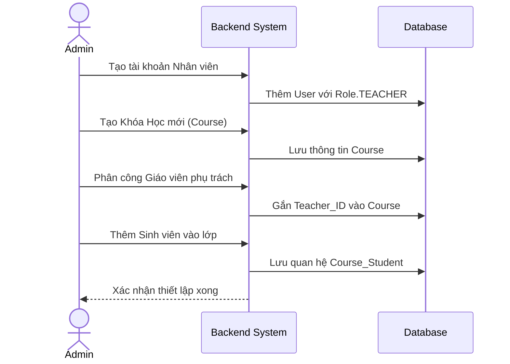
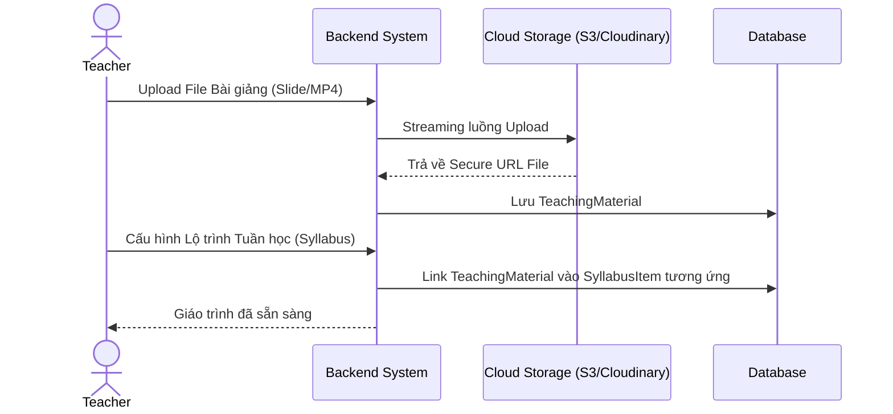
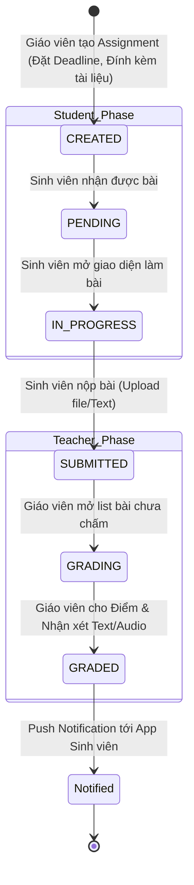
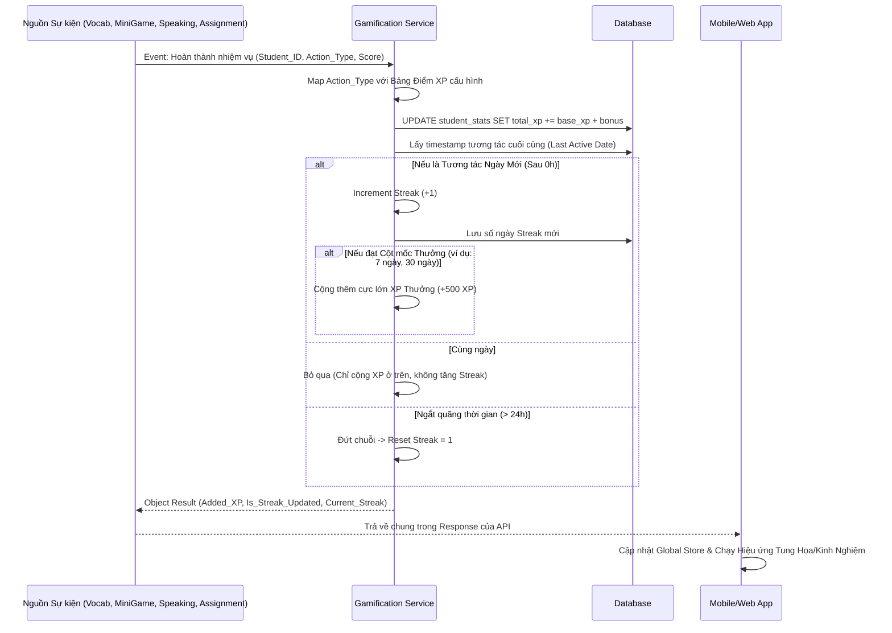

# Kiến trúc Luồng Xử Lý (Flow Architecture) - Module 4

*Tài liệu mô tả ĐẦY ĐỦ các luồng nghiệp vụ chuẩn cho Hệ thống Phân quyền, Giáo trình Lớp Học, Bài Tập và Gamification.*

---

## 1. Luồng Quản trị Quyền & Tổ chức Khóa học (Admin Role)
Quy trình Quản trị viên khởi tạo môi trường học tập.

---

## 2. Luồng Thiết lập Giáo trình & Tài liệu (Teacher Syllabus)
Giáo viên tải tài liệu và cấu hình chương trình giảng dạy.

---

## 3. Vòng đời Xử lý Bài Tập Về Nhà (Assignment Lifecycle)
Tương tác 2 chiều giữa Giáo viên (Giao bài & Chấm) và Học viên (Làm bài & Nộp).

---

## 4. Động cơ Gamification Trung Tâm (Global XP & Streak Engine)
Kiến trúc Micro-service/Event-driven xử lý điểm XP và Chuỗi ngày học (Streak) độc lập nhưng kết nối mọi tính năng.

