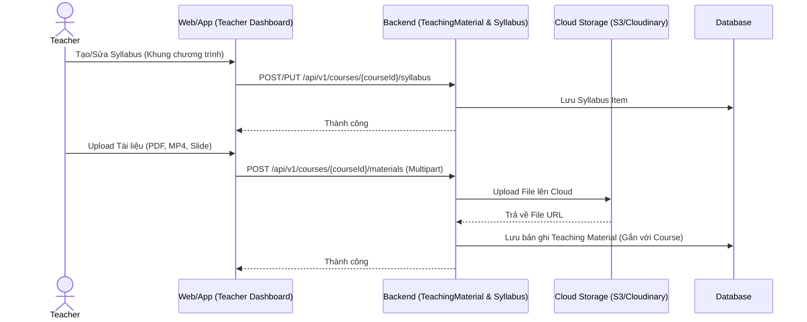
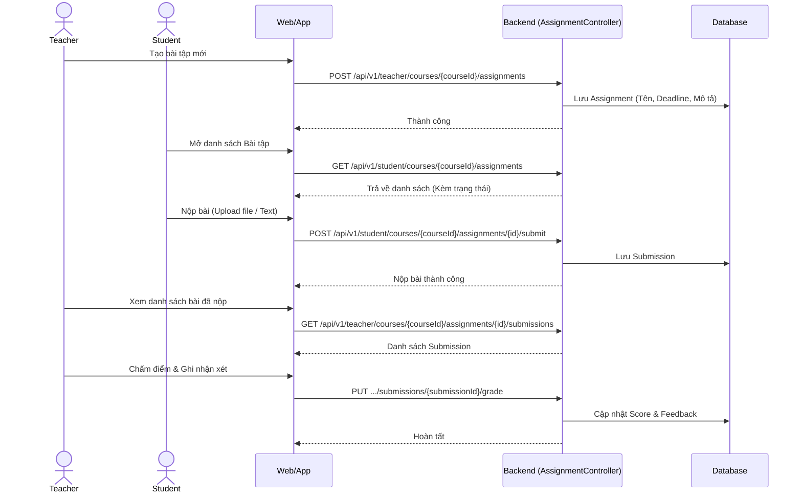
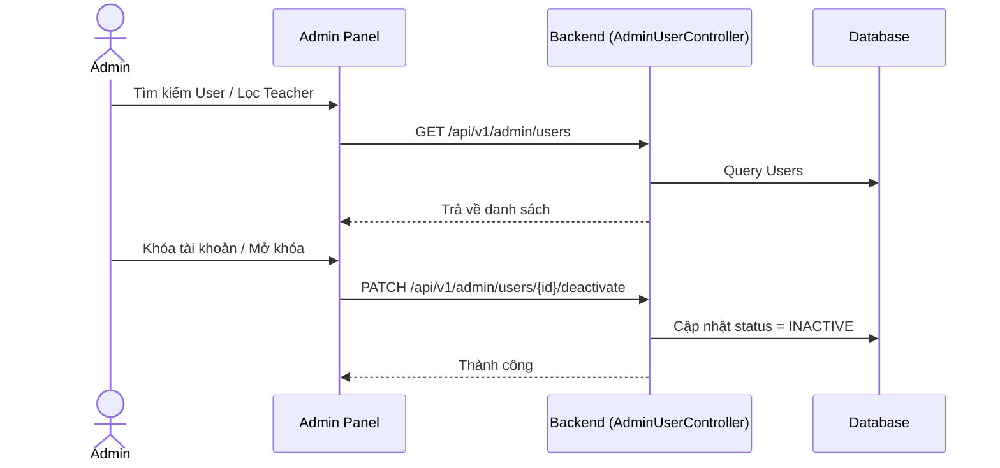

# Kiến trúc Luồng Xử Lý (Flow Architecture) - Module 4

*Tài liệu mô tả ĐẦY ĐỦ các luồng nghiệp vụ chuẩn và Đặc tả API (API Specification) chi tiết nhất cho hệ thống Học với Giáo viên & Quản lý Lớp học.*

---

## 1. Luồng Quản lý Tài liệu & Syllabus (Teacher Flow)
Giáo viên quản lý tài liệu học tập và lộ trình học (Syllabus) của lớp học.

### 📦 Đặc tả API tương ứng

#### 1.1 Quản lý Syllabus (SyllabusController)
- **`GET /api/v1/courses/{courseId}/syllabus`**: Lấy lộ trình.
- **`POST /api/v1/courses/{courseId}/syllabus`**: Tạo lộ trình.
  - **Body (JSON):** `{"title": "Week 1", "description": "Intro"}`
- **`PUT /api/v1/courses/{courseId}/syllabus/{itemId}`**: Cập nhật mục lục Syllabus.
- **`DELETE /api/v1/courses/{courseId}/syllabus/{itemId}`**: Xóa.

#### 1.2 Quản lý Tài liệu giảng dạy (TeachingMaterialController)
- **`GET /api/v1/courses/{courseId}/materials`**: Lấy danh sách tài liệu.
- **`POST /api/v1/courses/{courseId}/materials`**:
  - **Content-Type:** `multipart/form-data`
  - **Body:** `file` (File PDF/Docx/MP4), `title`, `description`.
  - **Response:** `200 OK` (Trả về metadata của file kèm URL).
- **`PUT /api/v1/courses/{courseId}/materials/{materialId}`**: Đổi tên tài liệu.
- **`DELETE /api/v1/courses/{courseId}/materials/{materialId}`**: Xóa file (Đồng thời xóa trên cloud).

---

## 2. Luồng Giao Bài Tập & Chấm Điểm (Assignment & Grading Flow)
Quy trình Giáo viên giao bài tập (Assignment), Học viên nộp bài (Submission) và Giáo viên chấm điểm (Grade).

### 📦 Đặc tả API tương ứng

#### 2.1 Giáo viên Giao bài & Chấm điểm (TeacherAssignmentController)
Chỉ role `TEACHER` và là giáo viên phụ trách khóa học mới được gọi (ADMIN không giao/chấm bài). Các ID lồng nhau (`courseId`/`assignmentId`/`submissionId`) phải khớp, nếu không trả 404. Query `page` bắt đầu từ 0; response `currentPage` bắt đầu từ 1.

- **`GET /api/v1/teacher/courses/{courseId}/assignments?keyword=&page=&size=`**: Danh sách bài tập. Mỗi phần tử có `submissionStats` = `{activeStudents, submittedCount, lateCount, gradedCount, notSubmittedCount}` (chỉ tính học viên ACTIVE; `lateCount` là bài nộp trễ chưa chấm).
- **`POST /api/v1/teacher/courses/{courseId}/assignments`** / **`PUT .../assignments/{assignmentId}`**:
  - **Body (JSON):** `{"title": "Homework 1", "description": "...", "moduleType": "VOCABULARY", "refId": 3, "deadlineAt": "2026-12-31T23:59:00"}`
  - `moduleType`: `PRONUNCIATION` (`refId` = id từ ví dụ IPA), `VOCABULARY` (`refId` = topicId), `SPEAKING` (`refId` = scenarioId). `deadlineAt` là LocalDateTime không kèm múi giờ, có thể bỏ trống.
  - Đổi `moduleType`/`refId` khi đã có bài nộp → `409` mã `9011 ASSIGNMENT_HAS_SUBMISSIONS`.
- **`DELETE .../assignments/{assignmentId}`**: Xóa bài tập chưa có bài nộp; đã có bài nộp → `409` mã `9011`.
- **`GET .../assignments/{assignmentId}/submissions?status=&page=&size=`**: Danh sách bài nộp, lọc tùy chọn theo `status` (`SUBMITTED`/`LATE`/`GRADED`). Mỗi bài nộp có `studentInfo` = `{id, fullName, email, avatarUrl}`.
- **`GET .../assignments/{assignmentId}/submissions/{submissionId}`**: Chi tiết bài nộp `{submission, result}`; `result` tóm tắt kết quả bài làm gốc theo `moduleType` (điểm phát âm, điểm mini-game, điểm phiên speaking…), `null` nếu kết quả đã bị xóa.
- **`PUT .../assignments/{assignmentId}/submissions/{submissionId}/grade`**: Chấm hoặc chấm lại (mỗi lần tăng `gradingRevision` và gửi thông báo cho học viên).
  - **Body (JSON):** `{"score": 85.5, "status": "GRADED", "teacherCommentText": "Good job!", "teacherAudioCommentUrl": "https://..."}`
  - `score` 0–100, tối đa 2 chữ số thập phân; `status` bắt buộc là `GRADED`; `teacherCommentText` tối đa 5000 ký tự; `teacherAudioCommentUrl` phải là URL HTTPS. Khi chấm lại cần gửi lại URL audio cũ nếu muốn giữ.
- **`POST /api/v1/teacher/upload-audio`** (multipart, field `file`): Tải audio nhận xét (MP3, WAV, WEBM, M4A; tối đa 5 MB), trả `{"url": "https://..."}` để dùng cho `teacherAudioCommentUrl`. Lỗi định dạng/kích thước → `400` mã `4003 INVALID_AUDIO_FILE`.

#### 2.2 Học viên Nộp bài (StudentAssignmentController)
- **`GET /api/v1/student/courses/{courseId}/assignments`**: Xem bài tập được giao.
- **`POST /api/v1/student/courses/{courseId}/assignments/{id}/submit`**:
  - **Body (JSON):** `{"resultRefId": 123}` — id log luyện phát âm (PRONUNCIATION), kết quả mini-game (VOCABULARY) hoặc phiên speaking đã COMPLETED (SPEAKING) của chính học viên và đúng `refId` của bài tập.
  - Nộp sau `deadlineAt` → trạng thái `LATE`. Bài đã `GRADED` không nộp lại được.

---

## 3. Luồng Quản Trị Hệ Thống (Admin Flow)
Admin quản lý User (Giáo viên, Học viên) và phân quyền.

### 📦 Đặc tả API tương ứng (AdminUserController)
- **`GET /api/v1/admin/users`**: Lấy danh sách toàn bộ User (Có phân trang, lọc theo `role`).
- **`POST /api/v1/admin/users`**: Tạo thủ công tài khoản (Thường dùng cấp tài khoản Teacher).
- **`PUT /api/v1/admin/users/{id}`**: Sửa thông tin User.
- **`PATCH /api/v1/admin/users/{id}/activate`**: Mở khóa tài khoản.
- **`PATCH /api/v1/admin/users/{id}/deactivate`**: Khóa tài khoản.
