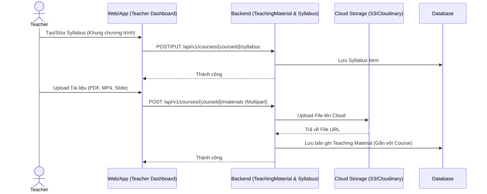
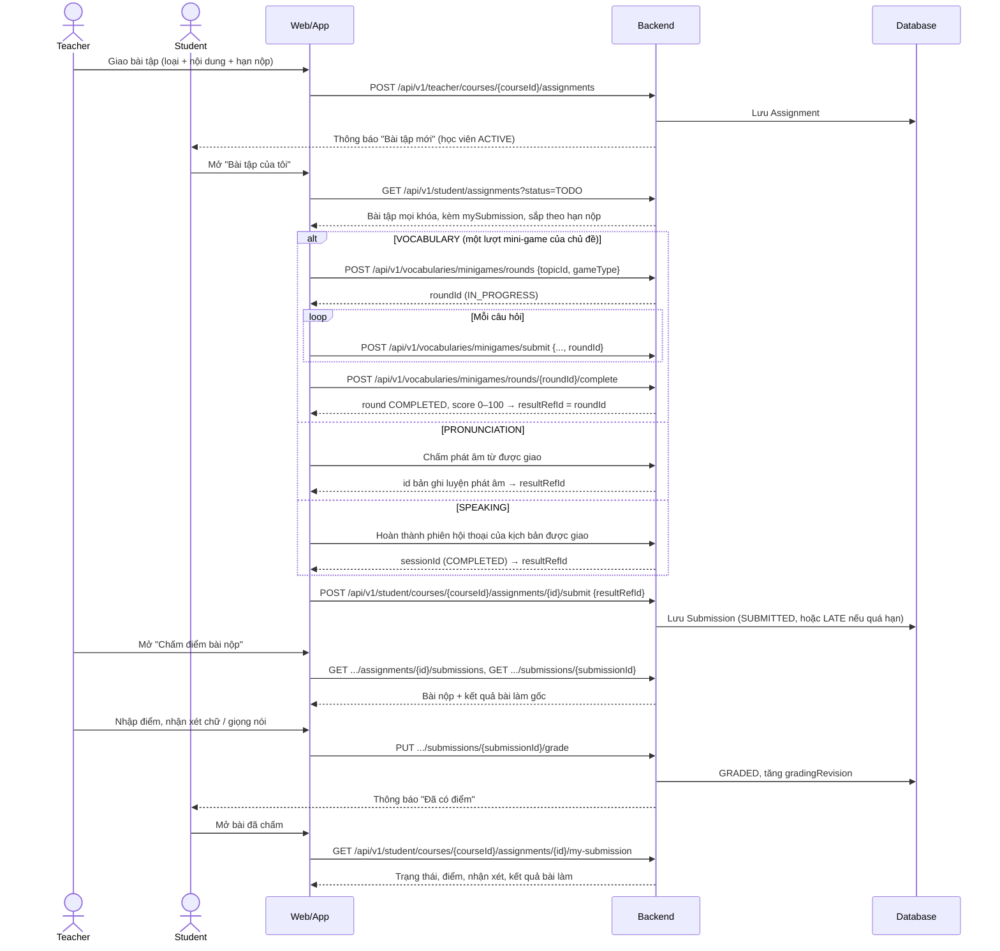
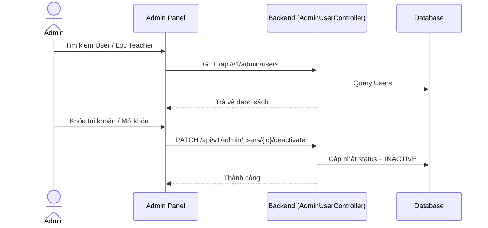

# Kiến trúc Luồng Xử Lý (Flow Architecture) - Module 4

*Tài liệu mô tả ĐẦY ĐỦ các luồng nghiệp vụ chuẩn và Đặc tả API (API Specification) chi tiết nhất cho hệ thống Học với Giáo viên & Quản lý Lớp học.*

---

## 1. Luồng Quản lý Tài liệu & Syllabus (Teacher Flow)
Giáo viên quản lý tài liệu học tập và lộ trình học (Syllabus) của lớp học.

### 📦 Đặc tả API tương ứng

#### 1.1 Quản lý Syllabus (SyllabusController)
- **`GET /api/v1/courses/{courseId}/syllabus`**: Lấy lộ trình.
- **`POST /api/v1/courses/{courseId}/syllabus`**: Tạo lộ trình.
  - **Body (JSON):** `{"title": "Week 1", "description": "Intro"}`
- **`PUT /api/v1/courses/{courseId}/syllabus/{itemId}`**: Cập nhật mục lục Syllabus.
- **`DELETE /api/v1/courses/{courseId}/syllabus/{itemId}`**: Xóa.

#### 1.2 Quản lý Tài liệu giảng dạy (TeachingMaterialController)
- **`GET /api/v1/courses/{courseId}/materials`**: Lấy danh sách tài liệu.
- **`POST /api/v1/courses/{courseId}/materials`**:
  - **Content-Type:** `multipart/form-data`
  - **Body:** `file` (File PDF/Docx/MP4), `title`, `description`.
  - **Response:** `200 OK` (Trả về metadata của file kèm URL).
- **`PUT /api/v1/courses/{courseId}/materials/{materialId}`**: Đổi tên tài liệu.
- **`DELETE /api/v1/courses/{courseId}/materials/{materialId}`**: Xóa file (Đồng thời xóa trên cloud).

---

## 2. Luồng Giao Bài Tập & Chấm Điểm (Assignment & Grading Flow)
Giáo viên giao bài tập gắn với một nội dung học có sẵn (từ vựng theo chủ đề, một từ luyện phát âm, hoặc kịch bản luyện nói AI). Học viên làm bài ngay trong app, nộp **id kết quả** của lần làm đó, giáo viên xem kết quả gốc rồi chấm điểm và nhận xét. Học viên xem lại điểm và nhận xét của mình.

**Trạng thái bài nộp:** chưa nộp (không có bản ghi) → `SUBMITTED` / `LATE` (nộp sau `deadlineAt`) → `GRADED`. Học viên nộp lại được (thay kết quả mới) cho đến khi bài được chấm; bài `GRADED` không nộp lại được. Hạn nộp không chặn việc nộp, chỉ đánh dấu `LATE`.

### 📦 Đặc tả API tương ứng

#### 2.1 Giáo viên Giao bài & Chấm điểm (TeacherAssignmentController)
Chỉ role `TEACHER` và là giáo viên phụ trách khóa học mới được gọi (ADMIN không giao/chấm bài). Các ID lồng nhau (`courseId`/`assignmentId`/`submissionId`) phải khớp, nếu không trả 404. Query `page` bắt đầu từ 0; response `currentPage` bắt đầu từ 1.

- **`GET /api/v1/teacher/courses/{courseId}/assignments?keyword=&page=&size=`**: Danh sách bài tập. Mỗi phần tử có `submissionStats` = `{activeStudents, submittedCount, lateCount, gradedCount, notSubmittedCount}` (chỉ tính học viên ACTIVE; `lateCount` là bài nộp trễ chưa chấm).
- **`POST /api/v1/teacher/courses/{courseId}/assignments`** / **`PUT .../assignments/{assignmentId}`**:
  - **Body (JSON):** `{"title": "Homework 1", "description": "...", "moduleType": "VOCABULARY", "refId": 3, "deadlineAt": "2026-12-31T23:59:00"}`
  - `moduleType`: `PRONUNCIATION` (`refId` = id từ ví dụ IPA), `VOCABULARY` (`refId` = topicId), `SPEAKING` (`refId` = scenarioId). `deadlineAt` là LocalDateTime không kèm múi giờ, có thể bỏ trống.
  - Đổi `moduleType`/`refId` khi đã có bài nộp → `409` mã `9011 ASSIGNMENT_HAS_SUBMISSIONS`.
- **`DELETE .../assignments/{assignmentId}`**: Xóa bài tập chưa có bài nộp; đã có bài nộp → `409` mã `9011`.
- **`GET .../assignments/{assignmentId}/submissions?status=&page=&size=`**: Danh sách bài nộp, lọc tùy chọn theo `status` (`SUBMITTED`/`LATE`/`GRADED`). Mỗi bài nộp có `studentInfo` = `{id, fullName, email, avatarUrl}`.
- **`GET .../assignments/{assignmentId}/submissions/{submissionId}`**: Chi tiết bài nộp `{submission, result}`; `result` tóm tắt kết quả bài làm gốc theo `moduleType` (điểm phát âm, điểm mini-game, điểm phiên speaking…), `null` nếu kết quả đã bị xóa.
- **`PUT .../assignments/{assignmentId}/submissions/{submissionId}/grade`**: Chấm hoặc chấm lại (mỗi lần tăng `gradingRevision` và gửi thông báo cho học viên).
  - **Body (JSON):** `{"score": 85.5, "status": "GRADED", "teacherCommentText": "Good job!", "teacherAudioCommentUrl": "https://..."}`
  - `score` 0–100, tối đa 2 chữ số thập phân; `status` bắt buộc là `GRADED`; `teacherCommentText` tối đa 5000 ký tự; `teacherAudioCommentUrl` phải là URL HTTPS. Khi chấm lại cần gửi lại URL audio cũ nếu muốn giữ.
- **`POST /api/v1/teacher/upload-audio`** (multipart, field `file`): Tải audio nhận xét (MP3, WAV, WEBM, M4A; tối đa 5 MB), trả `{"url": "https://..."}` để dùng cho `teacherAudioCommentUrl`. Lỗi định dạng/kích thước → `400` mã `4003 INVALID_AUDIO_FILE`.

#### 2.2 Học viên xem, làm và nộp bài (StudentAssignmentListController, StudentAssignmentController)
Chỉ role `STUDENT`. Các danh sách bài tập chỉ gồm khóa học đang mở mà học viên ở trạng thái `ACTIVE`. Mỗi bài tập có `mySubmission` = `{id, status, score, submittedAt, commentedAt, hasTeacherComment}` hoặc `null` nếu chưa nộp; `score` chỉ có khi `GRADED`.

- **`GET /api/v1/student/assignments?status=ALL|TODO|SUBMITTED|GRADED&page=&size=`**: Bài tập của tôi ở mọi khóa. `TODO` = chưa nộp, `SUBMITTED` = chờ chấm (gồm `LATE`), `GRADED` = đã có điểm. Sắp theo `deadlineAt` gần nhất, bài không có hạn ở cuối. Mỗi phần tử có thêm `courseName`. `size` tối đa 100 (mặc định 20).
- **`GET /api/v1/student/courses/{courseId}/assignments?keyword=&page=&size=`**: Bài tập của một khóa, kèm `mySubmission`.
- **`POST /api/v1/student/courses/{courseId}/assignments/{assignmentId}/submit`**:
  - **Body (JSON):** `{"resultRefId": 123}` — phải là kết quả của chính học viên và khớp `refId` của bài tập:

    | `moduleType` | `resultRefId` là | Điều kiện |
    |---|---|---|
    | `VOCABULARY` | id lượt mini-game (`minigame_rounds`) | cùng chủ đề (`refId` = topicId), trạng thái `COMPLETED` |
    | `PRONUNCIATION` | id bản ghi luyện phát âm | đúng từ ví dụ IPA (`refId`) |
    | `SPEAKING` | id phiên hội thoại | đúng kịch bản (`refId`), trạng thái `COMPLETED` |

  - Sai điều kiện → `400` mã `4001`. Nộp sau `deadlineAt` → `LATE`. Bài đã `GRADED` → `400` mã `4001`.
- **`GET /api/v1/student/courses/{courseId}/assignments/{assignmentId}/my-submission`**: Bài nộp của tôi `{submission, result}` (cùng dạng với API chi tiết của giáo viên). `score`, `teacherCommentText`, `teacherAudioCommentUrl`, `commentedAt` chỉ trả về khi `GRADED`. Chưa nộp → `404` mã `9006`.

#### 2.3 Lượt chơi mini-game từ vựng (MiniGameController)
Bài tập `VOCABULARY` được tính trên **một lượt chơi hoàn chỉnh** của chủ đề, không phải một câu trả lời.

- **`POST /api/v1/vocabularies/minigames/rounds`**: Bắt đầu lượt. **Body:** `{"topicId": 1, "gameType": "MATCHING_FLASH"}` → `{id, status: "IN_PROGRESS", totalQuestions: 0, ...}`. Chủ đề không tồn tại → `404` mã `8001`.
- **`POST /api/v1/vocabularies/minigames/submit`**: Như cũ, thêm trường tùy chọn `roundId`. Khi có `roundId`, câu trả lời được gắn vào lượt (tăng `totalQuestions`, `correctCount`, `xpEarned`, `durationSeconds`) và response có `roundId`. Từ vựng khác chủ đề hoặc khác `gameType` → `400` mã `4001`; lượt đã kết thúc → `409` mã `8011`; lượt không tồn tại / không phải của mình → `404` mã `8010`. Idempotency theo `attemptId` giữ nguyên.
- **`POST /api/v1/vocabularies/minigames/rounds/{roundId}/complete`**: Kết thúc lượt, `score = round(correctCount × 100 / totalQuestions)`, trạng thái `COMPLETED`. Gọi lại khi đã hoàn thành trả về kết quả cũ. Lượt chưa có câu nào → `400` mã `8012`.
- **`GET /api/v1/vocabularies/minigames/rounds/{roundId}`**: Xem lượt của mình.

> **Thay đổi so với trước (migration `V55__minigame_rounds.sql`):** `resultRefId` của bài `VOCABULARY` trước đây là id một dòng `minigame_results` (một câu, 100 hoặc 0 điểm), nay là id lượt chơi. Migration tự bọc mỗi bài nộp từ vựng cũ thành một lượt một câu đã `COMPLETED`, nên dữ liệu cũ vẫn hiển thị được. App mobile cần chuyển sang luồng lượt chơi ở trên trước khi nộp bài từ vựng.

---

## 3. Luồng Quản Trị Hệ Thống (Admin Flow)
Admin quản lý User (Giáo viên, Học viên) và phân quyền.

### 📦 Đặc tả API tương ứng (AdminUserController)
- **`GET /api/v1/admin/users`**: Lấy danh sách toàn bộ User (Có phân trang, lọc theo `role`).
- **`POST /api/v1/admin/users`**: Tạo thủ công tài khoản (Thường dùng cấp tài khoản Teacher).
- **`PUT /api/v1/admin/users/{id}`**: Sửa thông tin User.
- **`PATCH /api/v1/admin/users/{id}/activate`**: Mở khóa tài khoản.
- **`PATCH /api/v1/admin/users/{id}/deactivate`**: Khóa tài khoản.
